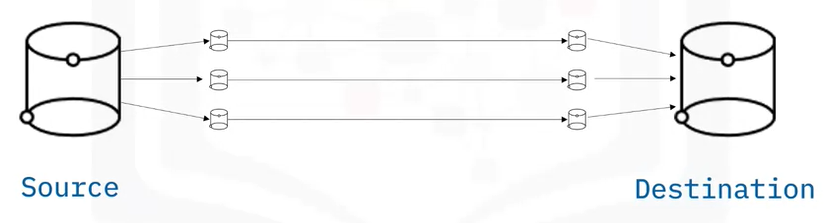
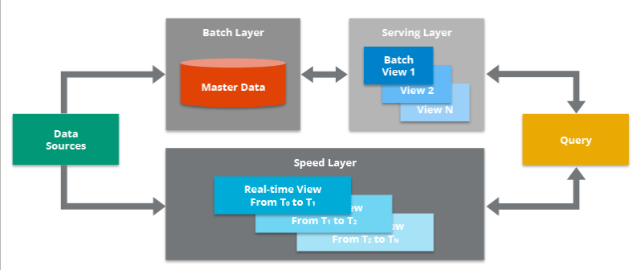

## ETL and DataPipeline

### Theory

#### 1. ETL

##### ETL

- Extract: Extracting data from a source
  
  - Configuring access to data and reading it into an application:
    
    - Web scrapting
    
    - Connecting programmatically via APIs
  
  - The data may be static or streaming online

- Transformation: Transforming data into the format for the output
  
  - Processing data
  
  - Conforming to target systems and use cases
  
  - Cleaning
  
  - Filtering
  
  - Joining
  
  - Feature engineering
  
  - Formatting and data typing

- Load: Loading data into a database, data warehouse or other storage
  
  - Moving data into a new environment
  
  - Examples: a database, datawarehouse, or data mart
  
  - Making the data readily available for analytics dashboards reports

##### ELT

- ELT is an emerging trend
  
  - Big Data -> Cloud computing
  
  - ELT seperates the data pipeline from the processing
  
  - More flexibility
  
  - No information loss (Many kinds of transformations can lead to information loss, and if these happen somewhere upstream in the pipeline, it may be a long time before you can have a change request met. Worse yet, the information may be forever lost if the raw data is not stored).

##### Differences between ETL and ELT

- When and where the transformations happen:
  
  - Transformations for ETL happen within the data pipeline
  
  - Transformations for ELT happen in the destination environment

- Flexibility:
  
  - ETL is rigid - pipelines are engineered to user specifications
  
  - ELT is flexible - end users build their own transformations

- Support for BigData:
  
  - Organizations use ETL for relational data, on-premise - scalability is difficult
  
  - ELT solves scalability problems, handling both structured and unstructured Big Data in the cloud

- Time-to-insight:
  
  - ETL workflows take time to specify and develop
  
  - ELT supports self-serve, interactive analytics in real time

##### Data Loading Techniques

- Full loading
  
  - Start tracking transactions in a new data warehouse
  
  - Used for porting over transaction history

- Incremental loading
  
  - Data is appended to, not overwritten
  
  - Used for accumulating transaction history
  
  - Depending on the volume and velocity of data, can be batch loaded or stream loaded

- Scheduled loading
  
  - Periodic loading, like daily transactions to database
  
  - Windows Task Scheduler, cron

- On-demand loading, triggered by
  
  - Measures such as data size
  
  - Event detection, like motion, sound, or temperature change
  
  - User requests, like video or music streaming, web pages

- Batch loading
  
  - Periodic updates using windows of data

- Stream loading
  
  - Continuous updates as data arrives

- Micro-batch loading
  
  - Short time windows used to access older data

- Client-server model
  
  - Pull - requests for data originate from the client
  
  - Push - server pushes data to clients

- Parallel loading
  
  - Multiple data streams
    
    
  
  - File partitioning
    
    

#### 2. DataPipeline

##### Data Pipeline Processes

- Stages of data pipeline processes:
  
  - Data extraction
  
  - Data ingestion
  
  - Transformation stages
  
  - Loading into destination facility
  
  - Scheduling or triggering
  
  - Monitoring
  
  - Maintenance and optimization

- Some key monitoring considerations include:
  
  - Latency
  
  - Throughput
  
  - Warnings, errors, failures
  
  - Utilization rate
  
  - Logging and alerting system

- Load balanced pipelines
  
  - Just-in-time data packet relays
  
  - No upstream data flow bottlenecks
  
  - Uniform packet throughput for each stage
  
  - Such a pipeline is called "load balanced"

- Handling unbalanced loads
  
  - Pipelines typically contain bottlenecks
  
  - Slower stages may be parallelized to speed up throughput
  
  - Processes can be replicated on multiple CPUs/cores/threads
  
  - Data packets are then distributed across these channels
  
  - Such pipelines are called dymanic or non-linear

- Stage synchronization
  
  - I/O buffers can help synchronize stages
  
  - Holding area for data between processing stages
  
  - Buffers regulate the flow of data, may improve throughput
  
  - I/O buffers used to distribute loads on parallelized stages

##### Batch vs. Streaming Data Pipeline

- Batch data pipelines
  
  - Operate on batches of data
  
  - Usually run periodically - hours, days, weeks apart
  
  - Can be initiated based on data size or other triggers
  
  - When latest data isn't needed
  
  - Typical choice when accuracy is critical
    
    *Note: Streaming alternatives are emerging*

- Streaming data pipelines
  
  - Ingest data packets in rapid succession
  
  - For real-time results
  
  - Records/events processed as they happen
  
  - Event streams can be loaded to storage
  
  - Users publish/subscribe to event streams

- Micro-batch data pipelines
  
  - Tiny micro-batches and faster processing simulate real-time processing
  
  - Smaller batches improve load balancing, lower latency
  
  - When short windows of data are required

- Batch vs. stream requirements
  
  - Tradeoff between accuracy and latency requirements
  
  - Data cleaning improves quality, but increases latency
  
  - Lowering latency increases potential for errors

- Lambda architecture
  
  
  
  - Data stream fills in "latency gap"
  
  - Used when data window is needed but speed is critical
  
  - Drawback is logical complexity
  
  - Lambda architecture = accuracy and speed

### Tools

#### 1. Airflow

#### 2. Kafka
