## ETL and DataPipeline

### Theory

#### 1. ETL

##### ETL

- Extract: Extracting data from a source
  
  - Configuring access to data and reading it into an application:
    
    - Web scrapting
    
    - Connecting programmatically via APIs
  
  - The data may be static or streaming online

- Transformation: Transforming data into the format for the output
  
  - Processing data
  
  - Conforming to target systems and use cases
  
  - Cleaning
  
  - Filtering
  
  - Joining
  
  - Feature engineering
  
  - Formatting and data typing

- Load: Loading data into a database, data warehouse or other storage
  
  - Moving data into a new environment
  
  - Examples: a database, datawarehouse, or data mart
  
  - Making the data readily available for analytics dashboards reports

##### ELT

- ELT is an emerging trend
  
  - Big Data -> Cloud computing
  
  - ELT seperates the data pipeline from the processing
  
  - More flexibility
  
  - No information loss (Many kinds of transformations can lead to information loss, and if these happen somewhere upstream in the pipeline, it may be a long time before you can have a change request met. Worse yet, the information may be forever lost if the raw data is not stored).

##### Differences between ETL and ELT

- When and where the transformations happen:
  
  - Transformations for ETL happen within the data pipeline
  
  - Transformations for ELT happen in the destination environment

- Flexibility:
  
  - ETL is rigid - pipelines are engineered to user specifications
  
  - ELT is flexible - end users build their own transformations

- Support for BigData:
  
  - Organizations use ETL for relational data, on-premise - scalability is difficult
  
  - ELT solves scalability problems, handling both structured and unstructured Big Data in the cloud

- Time-to-insight:
  
  - ETL workflows take time to specify and develop
  
  - ELT supports self-serve, interactive analytics in real time

##### Data Loading Techniques

- Full loading
  
  - Start tracking transactions in a new data warehouse
  
  - Used for porting over transaction history

- Incremental loading
  
  - Data is appended to, not overwritten
  
  - Used for accumulating transaction history
  
  - Depending on the volume and velocity of data, can be batch loaded or stream loaded

- Scheduled loading
  
  - Periodic loading, like daily transactions to database
  
  - Windows Task Scheduler, cron

- On-demand loading, triggered by
  
  - Measures such as data size
  
  - Event detection, like motion, sound, or temperature change
  
  - User requests, like video or music streaming, web pages

- Batch loading
  
  - Periodic updates using windows of data

- Stream loading
  
  - Continuous updates as data arrives

- Micro-batch loading
  
  - Short time windows used to access older data

- Client-server model
  
  - Pull - requests for data originate from the client
  
  - Push - server pushes data to clients

- Parallel loading
  
  - Multiple data streams
    
    
  
  - File partitioning
    
    

#### 2. DataPipeline

##### Data Pipeline Processes

- Stages of data pipeline processes:
  
  - Data extraction
  
  - Data ingestion
  
  - Transformation stages
  
  - Loading into destination facility
  
  - Scheduling or triggering
  
  - Monitoring
  
  - Maintenance and optimization

- Some key monitoring considerations include:
  
  - Latency
  
  - Throughput
  
  - Warnings, errors, failures
  
  - Utilization rate
  
  - Logging and alerting system

- Load balanced pipelines
  
  - Just-in-time data packet relays
  
  - No upstream data flow bottlenecks
  
  - Uniform packet throughput for each stage
  
  - Such a pipeline is called "load balanced"

- Handling unbalanced loads
  
  - Pipelines typically contain bottlenecks
  
  - Slower stages may be parallelized to speed up throughput
  
  - Processes can be replicated on multiple CPUs/cores/threads
  
  - Data packets are then distributed across these channels
  
  - Such pipelines are called dymanic or non-linear

- Stage synchronization
  
  - I/O buffers can help synchronize stages
  
  - Holding area for data between processing stages
  
  - Buffers regulate the flow of data, may improve throughput
  
  - I/O buffers used to distribute loads on parallelized stages

##### Batch vs. Streaming Data Pipeline

- Batch data pipelines
  
  - Operate on batches of data
  
  - Usually run periodically - hours, days, weeks apart
  
  - Can be initiated based on data size or other triggers
  
  - When latest data isn't needed
  
  - Typical choice when accuracy is critical
    
    *Note: Streaming alternatives are emerging*

- Streaming data pipelines
  
  - Ingest data packets in rapid succession
  
  - For real-time results
  
  - Records/events processed as they happen
  
  - Event streams can be loaded to storage
  
  - Users publish/subscribe to event streams

- Micro-batch data pipelines
  
  - Tiny micro-batches and faster processing simulate real-time processing
  
  - Smaller batches improve load balancing, lower latency
  
  - When short windows of data are required

- Batch vs. stream requirements
  
  - Tradeoff between accuracy and latency requirements
  
  - Data cleaning improves quality, but increases latency
  
  - Lowering latency increases potential for errors

- Lambda architecture
  
  
  
  - Data stream fills in "latency gap"
  
  - Used when data window is needed but speed is critical
  
  - Drawback is logical complexity
  
  - Lambda architecture = accuracy and speed

### Tools

#### 1. Airflow

#### 2. Kafka

##### Distributed Event Streaming Platform Components

- What is an Event?
  
  - Events describe an entity's observable state update over time.
  
  - Example: GPS coordinates of a car, temperature of a room, blood pressure of a patient, RAM usage of an application.

- One source to one destination
  
  - Event streaming from one event source to one destination
    
    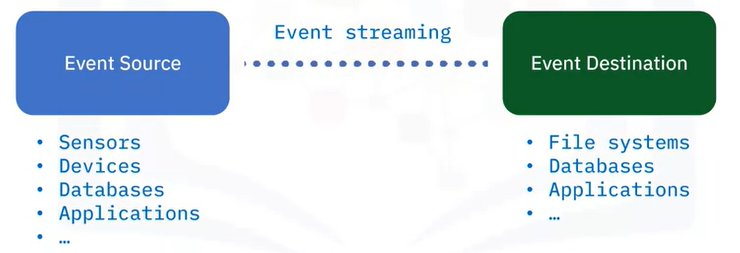

- Many sources to many destinations
  
  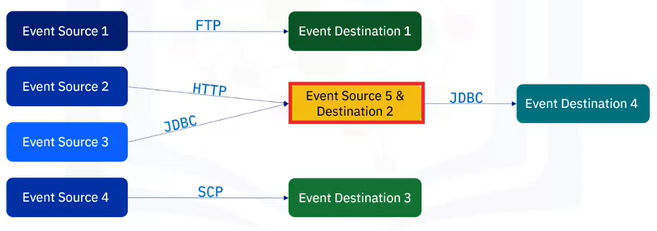

- Event Streaming Platform (ESP)
  
  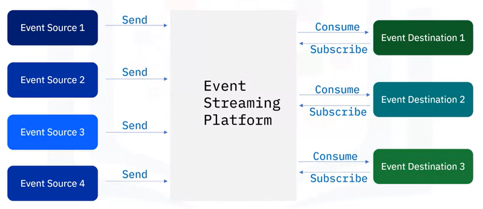
  
  - An ESP acts as a middle layer among various event sources and destinations and provides a unified interface for handling event-based ETL. As such, all event sources only need to send events to an ESP instead of sending them to the individual event destination. On the other side, event destinations only need to subscribe to an ESP, and just consume the events sent from the ESP instead of the individual event source.
  
  - Different ESPs may have different architectures and components.
  
  - Here are some common components included in most ESP systems:
    
    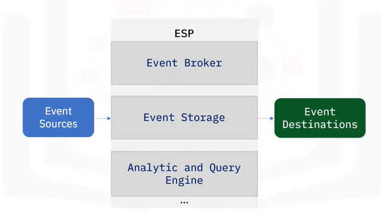
    
    - The first and foremost component is the Event broker, which is designed to receive and consume events.
    
    - The second common component of an ESP is Event Storage, which is used for storing events being received from event sources. Accordingly, event destinations do not need to synchronize with event sources, and stored events can be retrieved at will.
    
    - The third common component is the Analytic and Query Engine which is used for querying and analyzing the stored events.
  
  - Event broker: core component of an ESP
    
    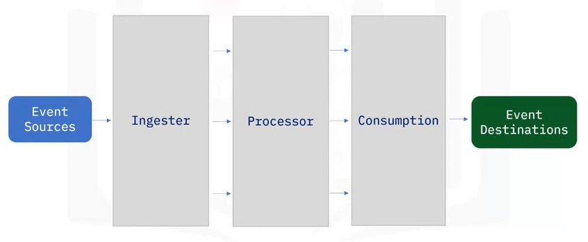
    
    - It normally contains three sub-components: ingester, processor, and consumption.
    
    - The ingester is designed to efficiently receive events from various event sources.
    
    - The processor performs operations on data such as serializing and deserializing; compressing and decompressing; encryption and decryption; and so on.
    
    - The consumption component retrieves events from event storage and efficiently distributes them to subscribed event destinations.

##### Apache Kafka Overview

- Kafka is a comprehensive platform and can be used in many application scenarios.

- Common use cases:
  
  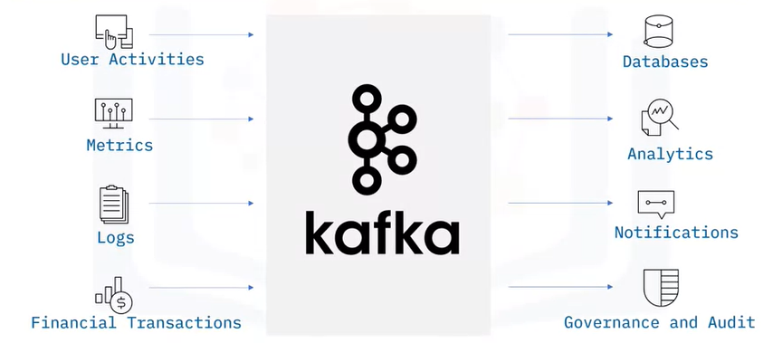

- Kafka architecture
  
  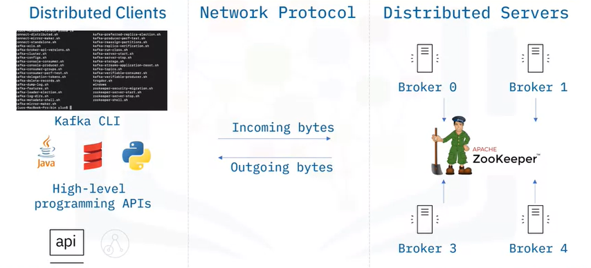
  
  - Kafka has a distributed client-server architecture: For the server side, Kafka is a cluster with many associated servers called brokers, acting as the event broker to receive, store, and distribute events. All those brokers are managed by another distributed system called ZooKeeper to ensure all brokers work in an efficient and collaborative way.
  
  - Kafka uses a TCP (Transmission Control Protocol) based network communication protocol to exchange data between clients and servers.
  
  - For the client side, Kafka provides different types of clients such as:
    
    - Kafka CLI, which is a collection of shell scripts to communicate with a Kafka server
    - Many high-level programming APIs such as Python, Java, and Scala
    - REST APIs
    - Specific 3rd party clients made by the Kafka community

- Main features of Apache Kafka
  
  - Distribution system
  
  - Highly scalable
  
  - Highly reliable
  
  - Permanent persistency
  
  - Open source

##### Building Event Streaming Pipelines using Kafka

- Broker and Topic
  
  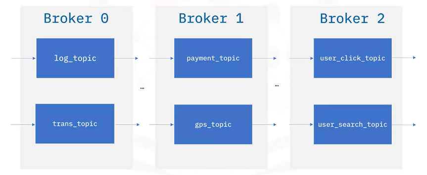
  
  - A Kafka cluster contains one or many brokers. You may think of a Kafka broker as a dedicated server to receive, store, process, and distribute events. Brokers are synchronized and managed by another dedicated server called ZooKeeper.
  
  - For example, in above picture, we have A log topic and a transaction topic in broker 0. A payment topic and a GPS topic in broker 1. and, a user click topic and user search topic in broker 2.
  
  - Each broker contains one or many topics. You can think of a `topic` as a database to store specific types of events, such as logs, transactions, and metrics.
  
  - Brokers manage to save published events into topics and distribute the events to subscribed consumers.

- Partition and replications
  
  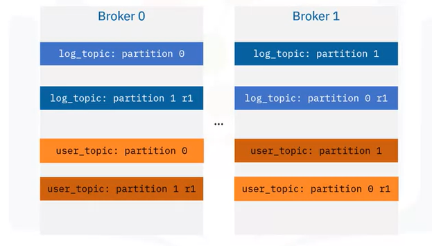
  
  - Kafka implements the concepts of partitioning and replicating.
  
  - It uses topic partitions and replications to increase fault-tolerance and throughput so that event publication and consumption can be done in parallel with multiple brokers. In addition, even if some brokers are down, Kafka clients are still able to work with the target topics replicated in other working brokers.
  
  - For example: A log topic has been separated into two partitions: 0, 1, and a user topic has been separated into two partitions: 0, 1.
  
  - And each topic partition is duplicated into two replications and stored in different brokers.(see above picture)

- Kafka topic CLI
  
  The Kafka CLI, or command line interface client provides a collection of powerful script files for users to build an event streaming pipeline: The Kafka-topics script is the one you probably will be using often to manage topics in a Kafka cluster.
  
  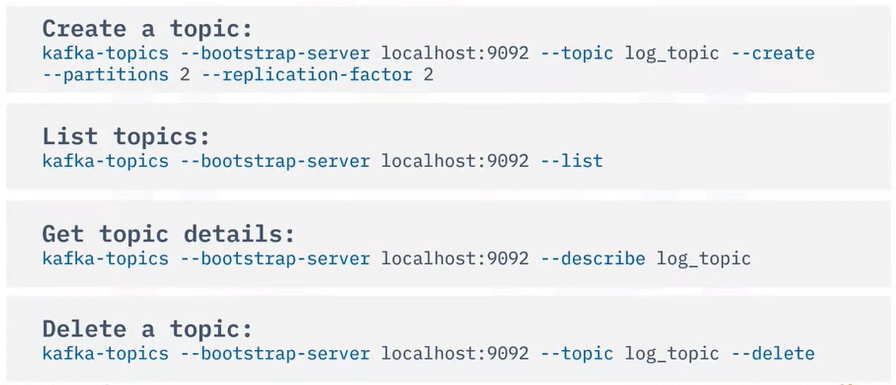

- Kafka Producer
  
  - Client applications that publish events to topic partition
  
  - An event can be optionally associated with a key
  
  - Events associated with the same key will be published to the same topic partition
  
  - Events not associated with any key will be published to topic partitions in rotation

- Kafka Producer in action
  
  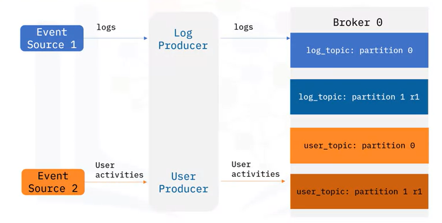

- Kafka producer CLI
  
  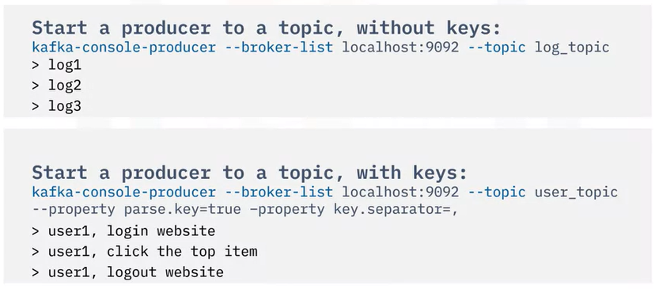

- Kafka consumer
  
  - Consumers are clients subscribed to topics
  
  - Consume data in the same order
  
  - Store an offset record for each partition
  
  - Offset can be reset to zero to read all events from the beginning again

- Kafka consumer in action
  
  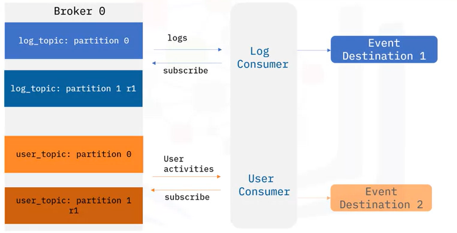

- Kafka consumer CLI
  
  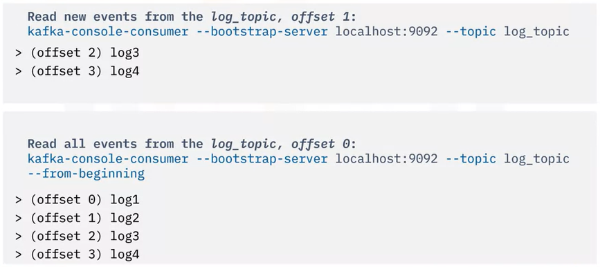

- A weather pipeline example
  
  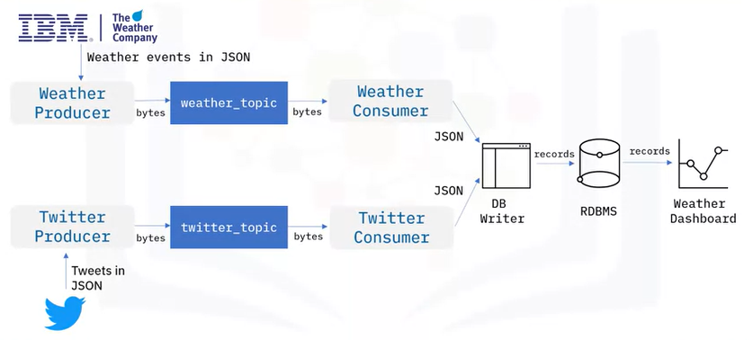

##### Kafka Streaming Process

- Ad hoc weather stream processing (example)
  
  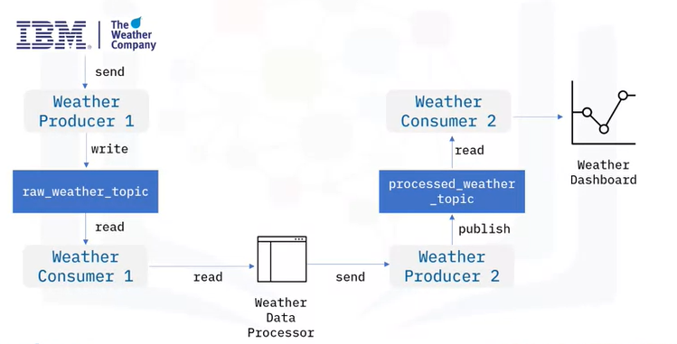

- Kafka Streams API
  
  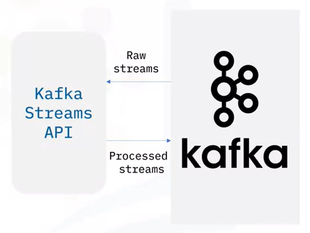
  
  - Simple client library to facilitate data processing in event streaming pipelines
  
  - Processes and analyzes data stored in Kafka topics
  
  - Record only processed once
  
  - Processing one record at a time

- Stream processing topology
  
  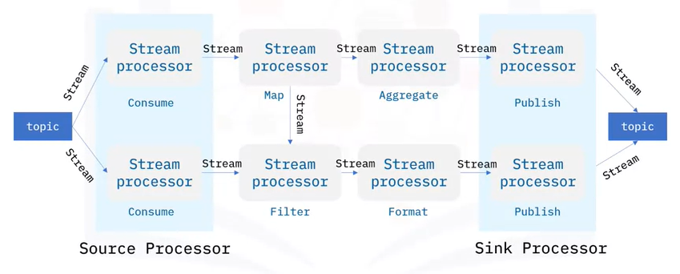
  
  - Kafka Streams API is based on a computational graph called a stream-processing topology.
  
  - In this topology, each node is a stream processor which receives streams from its upstream processor, performs data transformations such as mapping, filtering, formatting, aggregation, and produces output streams to its downstream stream processors. Thus, the edges of the graph are I/O streams.
  
  - There are two special types of processors:
    
    - On the left, you can see the source processor which has no upstream processors. A source processor acts like a consumer which consumes streams from Kafka topics and forwards the processed streams to its downstream processors.
    
    - On the right, you can see the sink processor, which has no downstream processors. A sink processor acts like a producer which publishes the received stream to a Kafka topic.

- Kafka weather stream processing (example)
  
  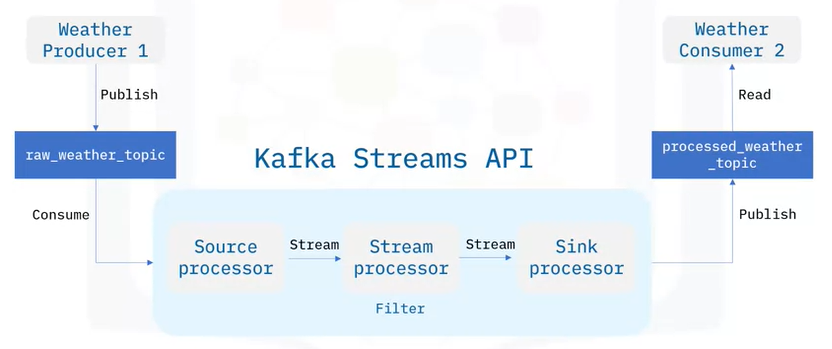
  
  

