## NoSQL

##### What is NoSQL?

- Refers to family of databases that vary widely in style and technology

- However, they share a common trait
  
  - Non-relational
  
  - Not standard row and column type RDBMS

- Could be referred to as "Non-relational databases"

- NoSQL databases:
  
  - Provide new ways of storing  and querying data
    
    - Address several issues for modern apps
  
  - Are designed to handle a different breed of scale - "Big Data"
  
  - Typically address more specialized use cases
  
  - Simpler to develop app functionality for than RDBMS

Characteristics of NoSQL Databases:

- They all differ technically speaking, but have a few commonalities

- Most NoSQL databases:
  
  - Are built to scale horizontally
  
  - Share data more easily than RDBMS
  
  - Use a global unique key to simplify data sharding
  
  - Are more use case specific than RDBMS
  
  - Are more developer friendly than RDBMS
  
  - Allow more agile development via flexible schemas

NoSQL Database categories:

- Key-Value

- Document

- Column

- Graph

##### NoSQL Key-Value

- Key-Value NoSQL Database Architecture
  
  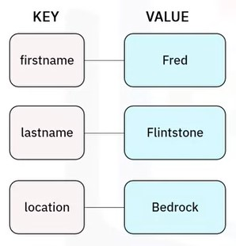
  
  - Least complex
  
  - Represented as hashmap Ideal for basic CRUD operations
  
  - Scale well
  
  - Shard easily
  
  - Not intended for complex queries
  
  - Atomic for single key operations only
  
  - Value blobs are opaque to database
    
    - Less flexible data indexing and querying

- Suitable Use Cases
  
  - For quick basic CRUD operations on non-interconnected data
    
    - *e.g.* Storing and retrieving session information for web applications
  
  - Storing in-app user profiles and preferences
  
  - Shopping cart data for online stores

- Unsuitable Use Cases
  
  - For data that is interconnected with many-to-many relationships
    
    - Social networks
    
    - Recommendation engines
  
  - When high-level consistency is required for multi-operation transactions with multiple keys
    
    - Need a database that provides ACID transactions
  
  - When apps run queries based on value vs key
    
    - Consider using 'Document' category of NoSQL database

- Examples: redis, Memcached, ...

##### NoSQL Document

- Document-Based NoSQL Database Architecture
  
  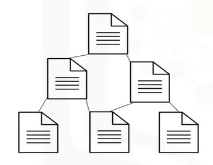
  
  - Values are visible and can be queried
  
  - Each piece of data is considered a document
    
    - Typically JSON or XML
  
  - Each document offers a flexible schema
    
    - No two documents need to contain the same information
  
  - Content of document databases can be indexed and queried
    
    - Key and value range lookups and search
    
    - Analytical queries with MapReduce
  
  - Horizontally scalable
  
  - Allow sharding across multiple nodes
  
  - Typically only guarantee atomic operations on single documents

- Suitable Use Cases
  
  - Event logging for apps and processes - each event instance is represented by a new document
  
  - Online blogs - each user, post, comment, like, or action is represented by a document
  
  - Operational datasets and metadata for web and mobile apps - designed with Internet in mind (JSON, RESTfulAPIs, unstructured data)

- Unsuitable Use Cases
  
  - When you require ACID transactions
    
    - Document databases can't handle transactions that operate over multiple documents
    
    - Relational database would be a better choice
  
  - If your data is in an aggregate-oriented design
    
    - If data naturally falls into a normalized tabular model
    
    - Relational database would be a better choice

- Examples: MongoDB, CouchDB, ...

##### NoSQL Column

- Column-Based NoSQL Database Architecture
  
  - Spawned from Google's Bigtable
  
  - a.k.a. Bigtable clones or Columnar or Wide-Column databases
  
  - Store data in columns or groups of columns
  
  - Column 'families' are several rows, with unique keys, belonging to one or more columns
    
    - Grouped in families as often accessed together
  
  - Rows in a column family are not required to share the same columns
    
    - Can share all, a subset, or none
    
    - Columns can be added to any number of rows, or not

- Suitable use cases
  
  - Great for large amounts of sparse data
  
  - Column databases can handle being deployed across clusters of nodes
  
  - Column databases can be used for event logging and blogs
  
  - Counters are a unique use case for column databases
  
  - Columns can have a TTL parameter, making them useful for data with an expiration value

- Unsuitable use cases
  
  - For traditional ACID transactions
    
    - Reads and writes are only atomic at the row level
  
  - In early development, query patterns may change and require numerous changes to column-based databases
    
    - Can be costly and can slow down the production timeline

- Examples: Cassandra, apache HBase, ...

##### NoSQL Graph

- Graph NoSQL Database architecture
  
  - Graph databases store information in entities (or nodes), and relationships (or edges)
  
  - Graph databases are impressive when your data set resembles a graph-like data structure
  
  - Graph databases do not shard well
    
    - Traversing a graph with nodes split across multiple servers can become difficult and hurt performance
  
  - Graph databases are ACID transaction compliant
    
    - Unlike other NoSQL databases discussed

- Suitable use cases
  
  - For highly connected and related data
  
  - Social networking
  
  - Routing, spatial, and map apps
  
  - Recommendation engines

- Unsuitable use cases
  
  - When looking for advantages offered by other NoSQL database categories
  
  - When an application needs to scale horizontally
    
    - You will quickly reach the limitations associated with these types of data stores
  
  - When trying to update all or a subset of nodes with a given parameter
    
    - These types of operations can prove to be difficult and non-trivial

### Working with Distributed Data

##### ACID vs BASE

- ACID vs. BASE consistency models
  
  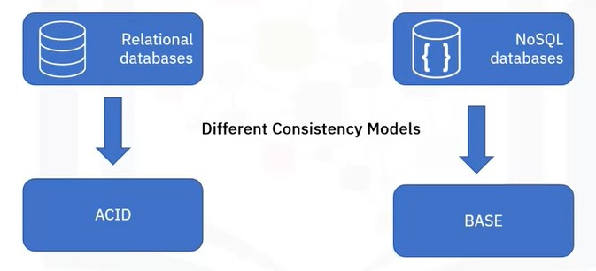

- ACID definition
  
  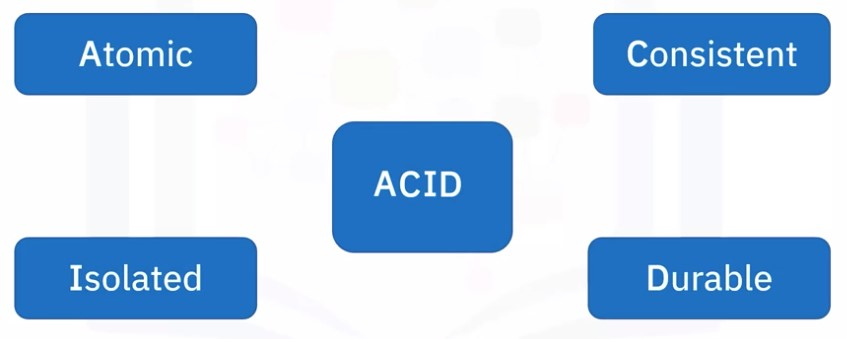

- ACID consistency model
  
  - Used by relational databases
  
  - Ensures a performed transaction is always consistent
  
  - Used by
    
    - Financial institutions
    
    - Data warehousing
  
  - Databases that can handle many small simultaneous transactions => relational databases
  
  - Fully consistent system

- BASE definition
  
  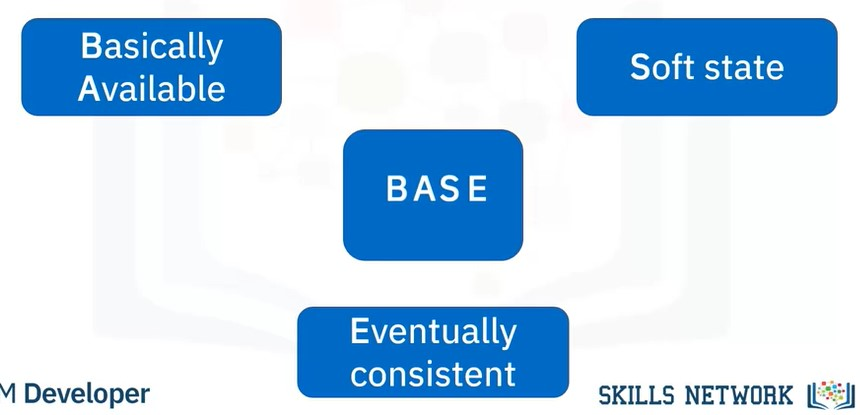

- BASE consistency model
  
  - NoSQL - few requirements for immediate consistency, data freshness, and accuracy
  
  - NoSQL benefits: availability, scale, and resilience
  
  - Used by:
    
    - Marketing and customer service companies
    
    - Social media apps
    
    - Worldwide available online services
  
  - Favors availability over consistency of data
  
  - NoSQL databases use BASE consistency model
  
  - Fully available system

##### Distributed Databases

- Concepts of distributed systems
  
  - Distributed database - a collection of multiple interconnected databases
  
  - Spread physically across various locations
  
  - Fragmentation and replication
  
  - BASE model

- Fragmentation
  
  - Example:
    
    - Fragmentation input data
      
      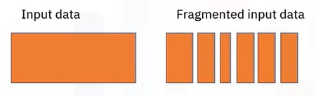
    
    - Fragmentation with distributed databases
      
      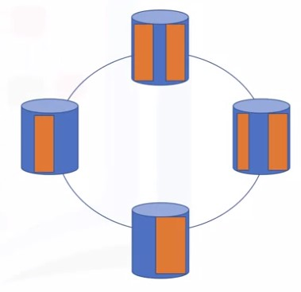
  
  - Fragmentating your data (partitioning, sharding)
    
    - Grouping keys lexically (for example, all records starting with A or A-C)
    
    - Grouping records by key (for example, all records with key StoreId = 123)

- Replication
  
  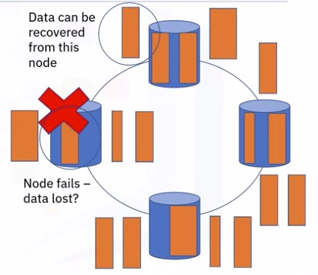
  
  - Protection of data for node failures
  
  - Replication: all data fragments are stored redundantly in two or more sites
  
  - Increases the availability of the data
  
  - Replicated data needs to be synchronized => could lead to inconsistencies

- Advantages of distributed systems
  
  - Reliability and availability
  
  - Improved performance
  
  - Query processing time reduced
  
  - Ease of growth/scale
  
  - Continuous availability

- Distributed databases challenges
  
  - Distributed databases bring availability, fast scaling, and global reach capabilities
  
  - Challenge: Concurrency control => consistency of data
    
    - WRITES/READS to a single node per fragment of data => data is synchronized in the background
    
    - WRITE operations go to all nodes holding a fragment of data, READS to a subset of nodes per Consistency
    
    - Developer-driven consistency of data
  
  - No Transactions support (or very limited)

##### The CAP Theorem

- The CAP theorem states that a distributed system can provide only two of three desired properties: consistency, availability, and partition tolerance. 
  
  **Consistency (C)**: Every client sees the same data. Every read receives the data from the most recent write. 
  
  **Availability (A)**: Every request gets a non-error response, but the response may not contain the most recent data.
  
  **Partition Tolerance (P)**: The system continues to operate despite one or more breaks in inter-node communication caused by a network or node failure.

- Because a distributed system must be partition tolerant, the only choices are deciding between availability and consistency.
  
  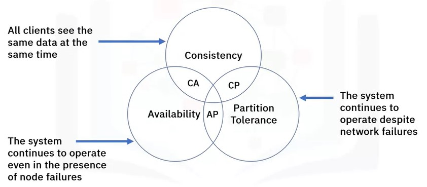

- Partition Tolerance
  
  - Partition - a lost or temporarily delayed connection between nodes
  
  - Partition tolerance - the cluster must work despite network issues
  
  - Distributed systems cannot avoid partitions and must be partition tolerant
  
  - Partition tolerance - basic feature of NoSQL

- NoSQL: CP or AP
  
  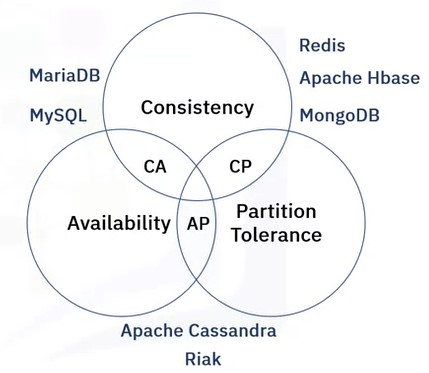
  
  - NoSQL - a choice between consistency and availability
  
  - MongoDB - consistency
  
  - Apache Cassandra - availability

##### Challenges in Migrating from RDBMS to NoSQL Database

- RDBMS and NoSQL
  
  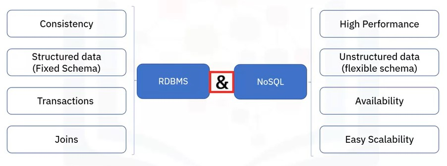

- RDBMS to NoSQL: a mindset change
  
  - Data driven model to Query driven data model
    
    - RDBMS: Starts from the data integrity, relations between entities
    
    - NoSQL: Starts from your queries, not from your data. Models based on the way the application interacts with the data
  
  - Normalized to Denormalized data
    
    - NoSQL: Think how data can be structured based on your queries
    
    - RDBMS: Start from your normalized data and then build the queries
  
  - From ACID to BASE model
    
    - Availability vs. Consistency
    
    - CAP Theorem - choose between availability and consistency
    
    - Availability, performance, geographical presence, high data volumes
  
  - NoSQL systems, by design, do not support transactions and joins (except in limited cases)

#### MongoDB

##### Overview of MongoDB

- A document and a NoSQL database

- Where data is structured in non-relational way

- What are documents?
  
  - Associative arrays like JSON objects or Python dictionaries
  
  - For example, a student document:
    
    ```json
    {
        "firstName": "Mít",
        "lastName": "Linh",
        "email": "MitHam@love.t2n"
        "studentId": 19982308
    }
    ```

- What is a Collection?
  
  - A group of stored documents
  
  - For example, all student records in Students section (`collection`) and staff records in Employees section (`collection`)

- What is a Database?
  
  - Database stores `Collections`
  
  - For example, Students and Employees collections stored in a database called CampusManagementDB

- Why use MongoDB?
  
  - Model data as you read/write, not the other way
    
    - Traditional relational databases: create schema first, then create tables
    
    - To store another field, you have to alter tables
  
  - Bring structured/unstructured data
  
  - High availability

- Where to use MongoDB
  
  - MongoDB is a popular choice of database for
    
    - Large and unstructured
    
    - Complex
    
    - Flexible
    
    - Highly scalable applications
    
    - Self-managed, hybrid, or cloud hosted

- Advantages of MongoDB
  
  - Flexibility with Schema
  
  - Code-first Approach
    
    - In relational databases
      
      - Design
      
      - then Code
    
    - In MongoDB, code first!
      
      - No complex table definitions
      
      - Write as soon as you connect to DB
  
  - Evolving Schema
  
  - Unstructured data
  
  - Querying and Analytics
    
    - MongoDB querying using MQL
    
    - Has a wide range of operators
    
    - For complex analysis use aggregation pipelines
  
  - High Availability
    
    - MongoDB is natively a highly available system:
      
      - Resilience through redundancy
      
      - No system maintenance downtime
      
      - No upgrade downtime

##### Indexes

- Why we need Indexes
  
  - Indexes help quickly locate data without looking for it everywhere
  
  - For example: in British Library, find *Designing Data-Intensive Applications* by Martin Kleppmann:
    
    - Without indexes: You will need to look through all of them
    
    - With indexes: Go to Computers/Databases/M (for Martin)

- Indexes in MongoDB
  
  - MongoDB indexes are special data structures
  
  - They store the fields you are indexing
  
  - They also store the location of document

##### Replication & Sharding

- Replication
  
  - A MongoDB Replica Set is a cluster of data bearing nodes, each maintaining a copy of the same data
    
    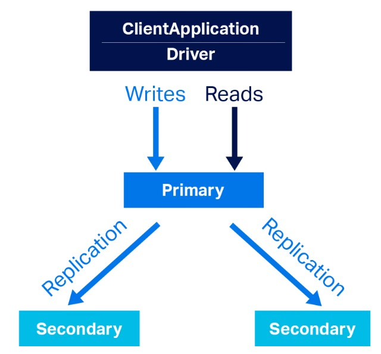
  
  - Benefits of Replication
    
    - Redundancy
    
    - High availability
    
    - Fault tolerance
    
    - Misconception - Replication does not equal disaster recovery

- Sharding (Horizontal Scaling)
  
  - Data is growing beyond hardware capacity:
    
    - Scale vertically (bigger, faster hardware)
    
    - Scale horizontally (partition the data)
  
  - Benefits of Sharding
    
    - Helps with increased throughput and capacity
    
    - Could be for legal requirements

#### Cassandra

## BIG DATA

#### Introduction to Big Data

##### What is Big Data

- The four V's of Big Data
  
  - Velocity:
    
    - Description:
      
      - Data that is generated fast
      
      - Process that never stops
    
    - Attributes:
      
      - Batch
      
      - Close to real time
      
      - Streaming
    
    - Drivers:
      
      - Improved connectivity and hardware
      
      - Rapid response times
  
  - Volume
    
    - Description
      
      - Scale of data
      
      - Increased amount of stored data
    
    - Attributes
      
      - Petabytes
      
      - Exa
      
      - Zetta
    
    - Drivers
      
      - Increase in data sources
      
      - Higher resolution sensors
      
      - Scalable infrastructure
  
  - Variety
    
    - Description
      
      - Data that comes from machines, people, and processes
      
      - Structured, semi-structured, and unstructured data
    
    - Attributes
      
      - Structure, complexity, and origin
    
    - Drivers
      
      - Mobile technologies
      
      - Scalable infrastructure
      
      - Resilience
      
      - Fault recovery
      
      - Efficient storage and retrieveal
  
  - Veracity
    
    - Description
      
      - Quality, origin, and conformity of facts
      
      - Accuracy of data
      
      - Data that comes from people and processes
    
    - Attributes
      
      - Consistency and compleness
      
      - Integrity
      
      - Ambiguity
    
    - Drivers
      
      - Cost and traceability
      
      - Robust ingestion
      
      - ETL mechanisms

- Parallel Processing, Scaling, and Data Parallelism
  
  - Linear vs. parallel processing
    
    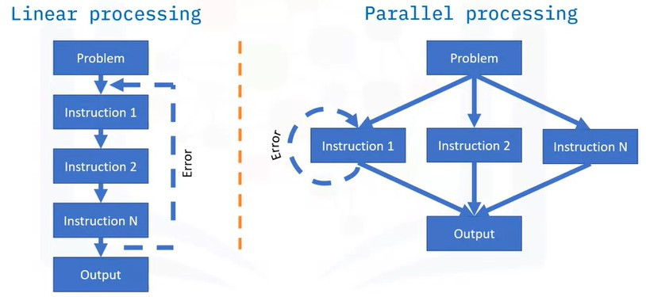
  
  - Why parallel processing is apt for Big Data
    
    - Parallel Processing advantages
      
      - Parallel processing approach can process large datasets in a fraction of time
      
      - Less memory and compute requirements needed as set of instructions are distributed to smaller execution nodes
      
      - More execution nodes can be added or removed from the processing network depending on complexity of the problem

#### Hadoop Ecosystem

##### Introduction to Hadoop

- What is Hadoop?
  
  - Set of open-source programs and procedures
  
  - Used for processing large amounts of data
  
  - Servers run applications on cluster
  
  - Handles parallel jobs or processes

- How does Hadoop work?
  
  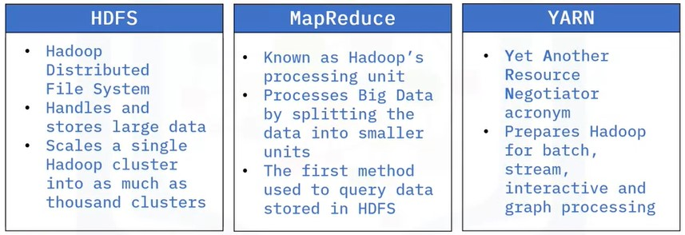

- The challenges of  Hadoop
  
  - Processing transactions (random access)
  
  - When work cannot be parallelized
  
  - When there are dependencies in the data
  
  - Low latency data access
  
  - Processing lots of small files
  
  - Intensive calculations with little data

##### Intro to MapReduce

- What is MapReduce?
  
  - Programming model used in Hadoop for processing Big Data
  
  - Processing technique for distributed computing
  
  - Consists of a Map task and a Reduce task
  
  - Can be coded in many programming languages like Java, C++, Python, Ruby and R

- Map and reduce
  
  - Input file
  
  - Map: Processes data into key value pairs
  
  - Further data sorting and organizing
  
  - Reducer: Aggregates and computes a set of result and produces a final output
  
  - MapReduce keeps track of its task by creating a unique key

- How MapReduce works
  
  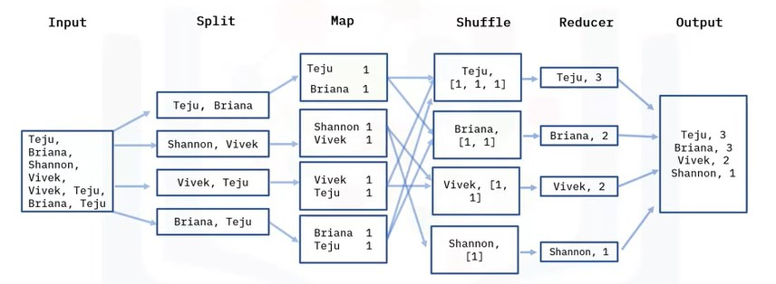

- Why use MapReduce?
  
  - Parallel Computing
  
  - Process data in tabular and Non tabular forms, such as videos
  
  - Support for multiple languages
  
  - Platform for analysis and data ware housing

##### Hadoop ecosystem

- The Hadoop ecosystem is made up of components that support one another
  
  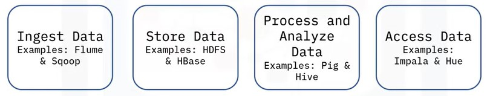

- Ingest data
  
  - Flume
    
    - Collects, aggregates, and transfers big data
    
    - Has a simple and flexible architecture based on streaming data flows
    
    - Uses a simple extensible data model that allows for online analytic application
  
  - Sqoop
    
    - Designed to transfer data between relational database systems and Hadoop
    
    - Accesses the database to understand the the schema of the data
    
    - Generates a MapReduce application to import or export the data

- Store
  
  - HBase
    
    - A non-relational database that runs on top of HDFS
    
    - Provides real time wrangling on data
    
    - Stores data as indexes to allow for random and faster access to data
  
  - Cassandra
    
    - A scalable, NoSQL database designed to have no single point of failure

- Analyze data
  
  - Pig
    
    - Analyzes large amounts of data
    
    - Operates on the client side of a cluster
    
    - A procedural data flow language
  
  - Hive
    
    - Used for creating reports
    
    - Operates on the server side of a cluster
    
    - A declarative programming language

- Access Data
  
  - Impala
    
    - Scalable and easy to use platform for everyone
    
    - No programming skills required
  
  - Hue
    
    - Stands for Hadoop user experience
    
    - Alloes you to upload, browse, and query data
    
    - Runs Pig jobs and workflow
    
    - Provides editors for several SQL query languages like Hive and MySQL

##### HDFS

- HDFS
  
  - HDFS is the acronym for Hadoop Distributed File System
  
  - It is the storage layer of Hadoop
  
  - Splits the files into blocks, creates replicas of the blocks, and stores them on different machines
  
  - Provides access to streaming data
  
  - HDFS uses a command line interface to interact with Hadoop

- Key features
  
  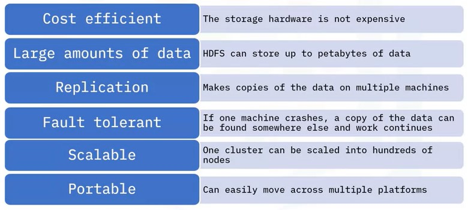

- HDFS concepts
  
  - Blocks
    
    - Minimum amount of data that can be read or written
    
    - Provides fault tolerance
    
    - Default size is 64MB or 128 MB
      
      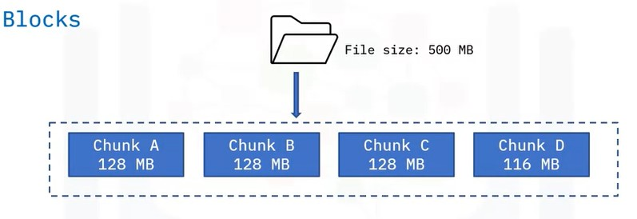
    
    - Each file stored doesn't have to take up the configured space size

- Nodes
  
  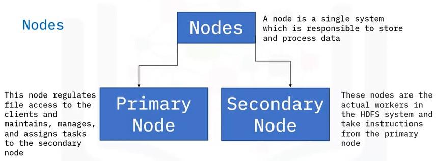

- Rack awareness in HDFS
  
  - Choosing data node racks that are closest to each other
  
  - Improves cluster performance by reducing network traffic
  
  - Name node keeps the rack ID information
  
  - Replication can be done through rack awareness

- Replication
  
  - Creating a copy of the data block
  
  - Copies are created for backup purpoess
  
  - Replication factor: Number of times the data block was copied

- Read and Write Operations
  
  - HDFS allows write once read many operations
    
    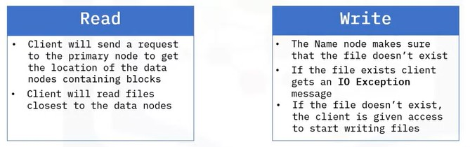
  
  - HDFS architecture
    
    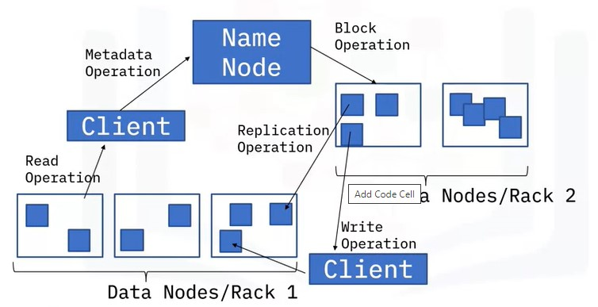

##### Hive

- Hive is data warehouse software within Hadoop that is designed for reading, writing and managing tabular-type datasets and data analysis:
  
  - It is scalable, fast, and easy to use
  
  - Hive Query Language (HiveQL) is inspired by SQL, making it easier for users to grasp concepts
  
  - It supports data cleansing and filtering depending on user's requirements

- Hive and traditional RDBMS compared
  
  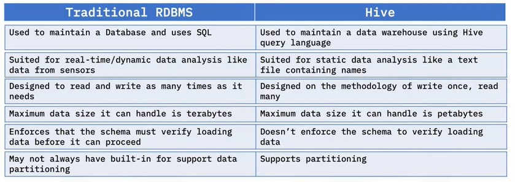

- Hive architecture
  
  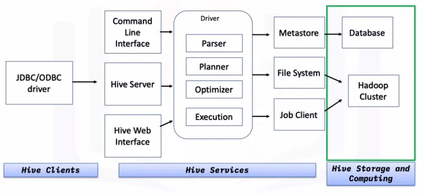

- Hive concepts
  
  - Clients
    
    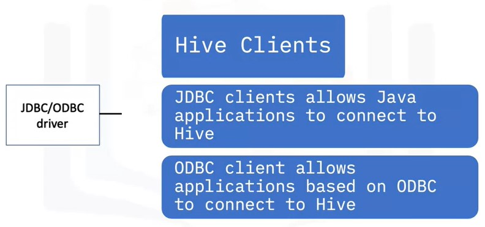
  
  - Hive Services
    
    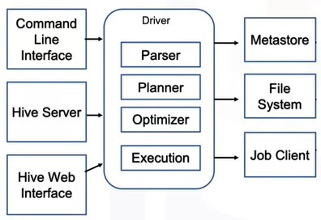
    
    - Hive Server to enable queries
    
    - The driver receives query statements
    
    - The optimizer is used to split tasks efficiently
    
    - The executor executes tasks after the optimizer
    
    - Metastore stores the metadata information about the tables

##### HBASE

- Define:
  
  - Column-oriented non-relational database management system
  
  - HBase runs on top of HDFS
  
  - Provides a fault-tolerant way of storing sparse datasets
  
  - Works well with real-time data and random read and write access to Big Data

- HBase is used for write-heavy applications
  
  - HBase is linearly and modularly scalable
  
  - It is a backup support for MapReduce jobs
  
  - It provides consistent reads and writes
  
  - It has no fixed column schema
  
  - It is an easy-to-use Java API for client access
  
  - It provides data replicatopm across clusters

- Characteristic:
  
  - Predefine the table schema and specify column families
  
  - New columns can be added to column families at anytime
  
  - HBase schema is very flexible
  
  - HBase has master nodes to manage the cluster and region servers to perform the work

- Differences between HBase and HDFS
  
  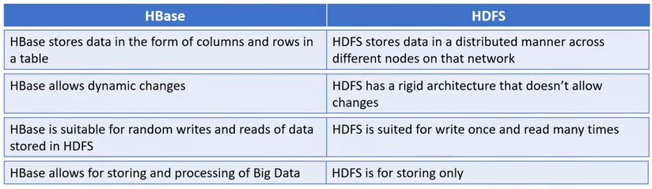

- HBase architecture
  
  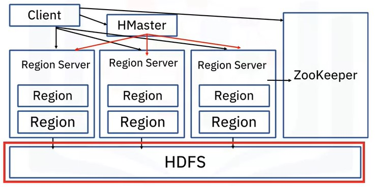

- HBase concepts
  
  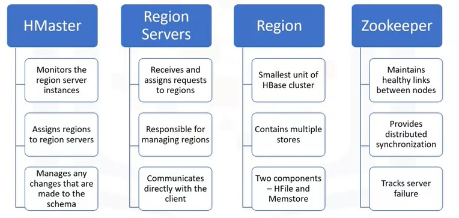

#### Apache Spark

##### Why use Apache Spark?

- Spark is an open source in-memory application framework for distributed data processing and iterative analysis on massive data volumes

- What is Distributed Computing?
  
  - A group, or cluster, of computers working together to appear as one system to the end user
  
  - Parallel vs. Distributed Computing
    
    - Parallel computing processors access shared memory
    
    - Distributed computing processors usually have their own private or distributed memory

- Spark Benefits
  
  - Supports a computing framework for large scale data processing and analysis
  
  - Provides parallel and distributed processing, scalability and fault tolerance on commodity hardware
  
  - Provides speed due to in-memory processing
  
  - Creates a comprehensive, unified framework to manage big data processing
  
  - Enables programming flexibility with easy-to-use Python, Scala, and Java APIs

- Apache Spark & MapReduce Compared
  
  - Traditional Approach:
    
    - Create MapReduce jobs for complex jobs, interactive query, and online event-hub processing involves lots of (slow) disk I/O
      
      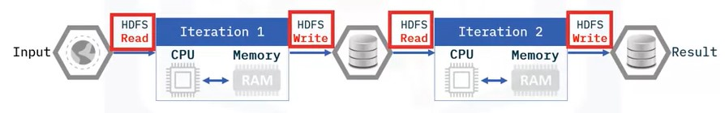
  
  - Solution:
    
    - Keep more data in-memory with a new distributed execution engine
      
      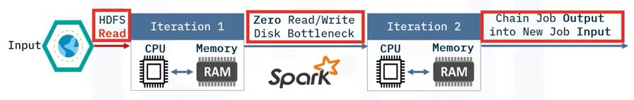

- Spark and Big Data
  
  - Data engineering
    
    - Core Spark engine
    
    - Clusters and executors
    
    - Cluster management
    
    - SparkSQL
    
    - Catalyst Tungsten DataFrames
  
  - Data Science and ML
    
    - SparkML
    
    - DataFrames
    
    - Streaming

##### Parralel Programming using Resilient Distributed Datasets

- What are RDDs
  
  - A resilient distributed dataset is:
    
    - Spark's primary data abstraction
    
    - A fault-tolerant collection of elements
    
    - Partitioned across the nodes of the cluster
    
    - Capable of accepting parallel operations
    
    - Immutable

- What is Parallel Programming
  
  - Is the imultaneous use of multiple compute resources to solve a computational problem
  
  - Breaks problems into discrete parts that can be solved concurrently
  
  - Runs simultaneous instructions on multiple processors

- RDDs & Parallel Programming
  
  - You can create an RDD by parallelizing an array of objects, or by splitting a dataset into partitions
  
  - Spark runs one task for each partition of the cluster
    
    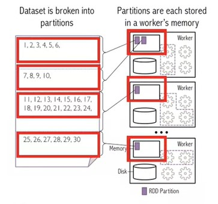

- Resilience and Spark
  
  RDDs:
  
  - Are always recoverable as they are immutable
  
  - Can persist or cache datasets in memory across operations, which speeds iterative operations

##### Scale out/ Data Parallelism in Spark

- Apache Spark Components
  
  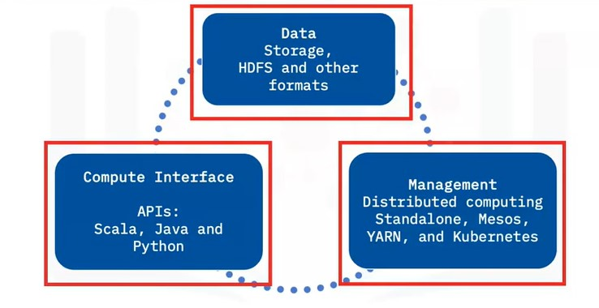

- Spark Core
  
  - Is a base engine
  
  - Is fault-tolerant
  
  - Performs large scale parallel and distributed data processing
  
  - Manages memory
  
  - Schedules tasks
  
  - Houses APIs that define RDDs
  
  - Contains a distributed collection of elements that are parallelized across the cluster

- Scaling big data in Spark
  
  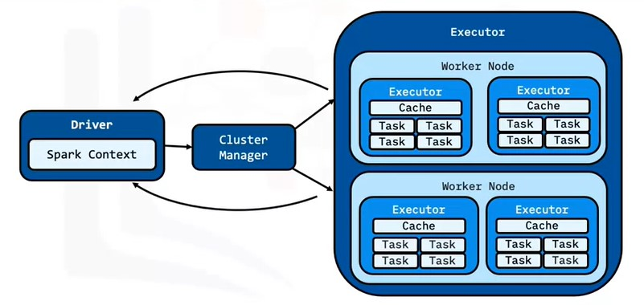

##### Dataframes and SparkSQL

- Spark SQL
  
  - Is a Spark module for structured data processing
  
  - Used to query structured data inside Spark programs, using either SQL or a familiar DataFrame API
  
  - Usable in Java, Scala, Python and R
  
  - Runs SQL queries over imported data and existing RDDs independently of API or programming language
  
  - Example:
    
    `results = spark.sql("SELECT * FROM people")`
    
    `names = results.map(lambda p: p.name)`
  
  - Benefits:
    
    - Includes a cost-based optimizer, columnar storage, and code generation to make queries fast
    
    - Scales to thousands of nodes and multi-hour queries using the Spark engine, which provides full mid-query fault tolerance
    
    - Provides a programming abstraction called DataFrames and can also act as a distributed SQL query engine

- DataFrames
  
  - Distributed collection of data organized into named columns
  
  - Conceptually equivalent to a table in a relational database or a data frame in R/Python, but with richer optimizations
  
  - Built on top of the RDD API
  
  - Uses RDDs
  
  - Performs relational queries

- DataFrame Benefits
  
  - Ability to scale from kilobytes of data on a single laptop to petabytes on a large cluster
  
  - Support for a wide array of data formats and storage systems
  
  - State-of-the-art optimization and code generation through the Spark SQL Catalyst optimizer
  
  - Seamless integration with all big data tooling and infrastructure via Spark
  
  - APIs for Python, Java, Scala and R

#### DataFrames and SparkSQL

##### RDDs in Parallel Programming and Spark

- Resilient Distributed Datasets
  
  - Are Spark's primary data abstraction
  
  - Are partitioned across the nodes of the cluster
    
    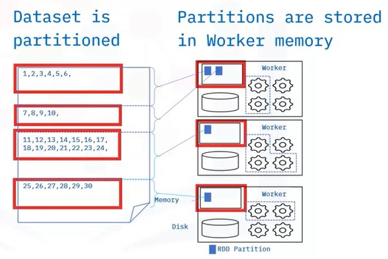

- RDD Transformations
  
  Transformations:
  
  - Create a new RDD from existing one
  
  - Are "lazy" because the results are only computed when evaluated by actions
  
  Example: The `map` transformation passes each element of a dataset through a function and returns a new RDD

- RDD Actions
  
  - Actions return a value to driver program after running a computation
  
  - Example: `reduce()`: an action that aggregates all RDD elements

- The Directed Acyclic Graph (DAG)
  
  - A graphical data structure with edges and vertices
  
  - Every new edge is obtained from an older vertex
  
  - In Apache Spark DAG, the vertices represents RDDs and the edges represent operations such as transformations or actions
  
  - If a node goes down, Spark replicates the DAG and restores the node.

- Transformation & Actions
  
  1. Spark creates the DAG when creating an RDD
  
  2. Spark enables  the DAG Schedular to perform a transformation and updates the DAG
  
  3. The DAG now points to the new RDD
  
  4. The pointer that transforms RDD is returned to the Spark driver program
  
  5. If there is an action, the driver program that calls the action evaluates the DAG only after Spark completes the action

- Transformation examples
  
  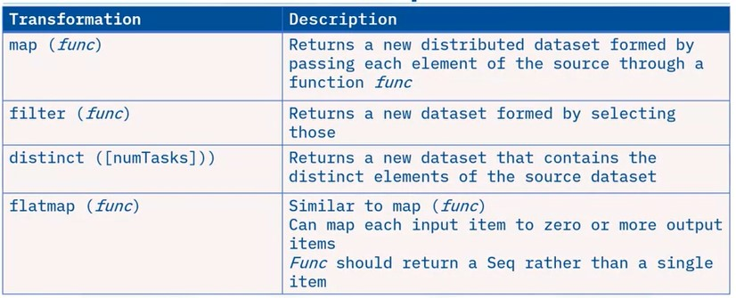

- Action examples
  
  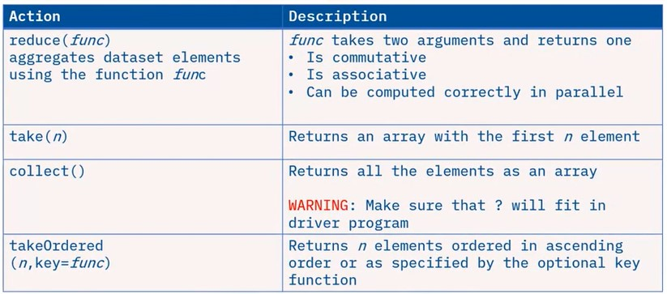

- A Transformation with an Action
  
  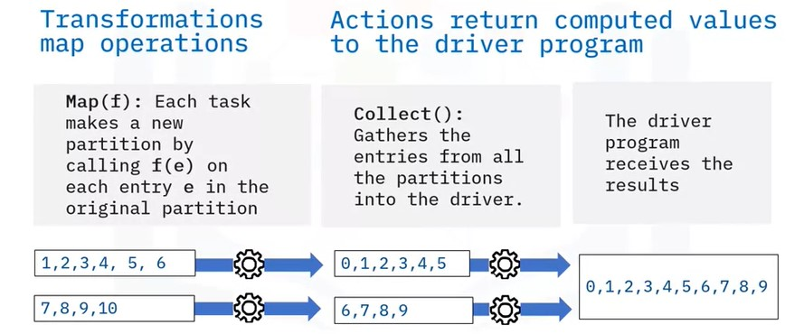

##### Data-frames and Datasets

- Datasets
  
  - A dataset is a distributed collection of data that:
    
    - Consists of a collection of strongly typed JVM objects
    
    - Provides the combined benefits of both RDDs and Spark SQL

- Datasets Features
  
  - Are immutable, meaning that data cannot be deleted or lost
  
  - Feature an encoder that converts JVM objects to a tabular representation
  
  - Extend DataFrame type-safe and object-oriented API capabilities
  
  - Work with both Scala and Java APIs

- Datasets in Spark - Benefits
  
  - Provide compile-time type safety
  
  - Compute faster than RDDs
  
  - Offer the benefits of Spark SQL and DataFrames
  
  - Optimize queries using Catalyst and Tungsten
  
  - Enable improved memory usage and caching
  
  - Use dataset API functions for aggregate operations including sum, average, join and group by

- Creating a dataset
  
  - Apply the `toDS()` function to create a dataset from a sequence
    
    ```scala
    // Create a Dataset from a sequence of primitive datatype
    val ds = Seq("Alpha", "Beta", "Gamma").toDS()
    ```

- Create a dataset from a text file
  
  ```scala
  val ds = spark.read.text("/text_folder/file.txt").as[String]
  ```

- Datasets & DataFrames Compared
  
  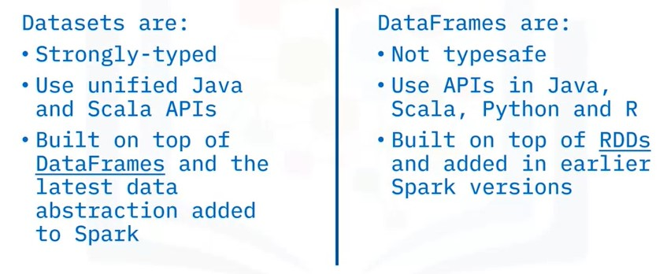

##### Catalyst and Tungsten

- Spark SQL Optimization goals
  
  - Reduce
    
    - Query time
    
    - Momory consumption
  
  - Save organiztions time and money

- SQL Optimization explained
  
  - `Rule-based optimization`: defines how to run the query
    
    - Examples:
      
      - Is the table is indexed?
      
      - Does the query contain only the required columns?
  
  - `Cost-based optimization`: equals time + memory a query cosumes
    
    - Examples:
      
      - What are the best paths for multiple datasets to use when querying data?

- Catalyst defined
  
  - Is the Spark SQL built-in *rule-based query* optimizer
  
  - Based on functional programming constructs in Scala
  
  - Supports the addition of new optimization techniques and features
  
  - Enables developers to add data source-specific rules and support new data types

- Catalyst query optimization
  
  - Uses a tree data structure and a set of rules
    
    - Four major phases of query execution
      
      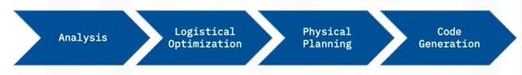

- Catalyst example
  
  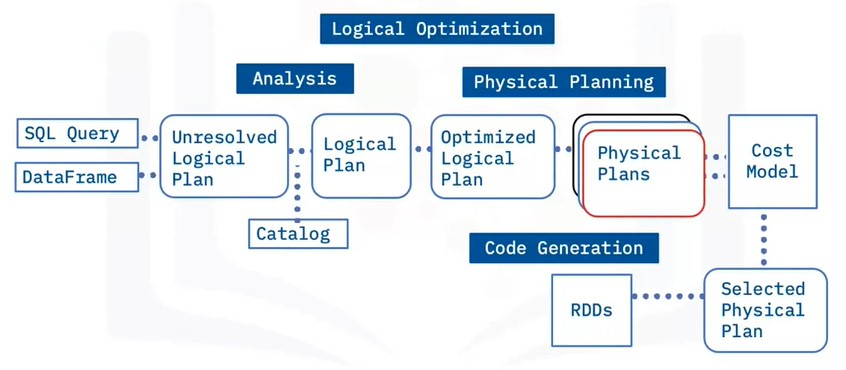

- Tungsten defined
  
  - Spark's *cost-based* optimizer that maximizes CPU and memory performance

- Tungsten Features
  
  - Manages memory explicitly and does not rely on the JVM object model or garbage collection
  
  - Enables cache-friendly computation of algorithms and data structures using both STRIDE-based memory access
  
  - Supports on-demand JVM byte code generation
  
  - Does not generate virtual function dispatches
  
  - Places intermediate data in CPU registers
  
  - Enables Loop unrolling

#### Development and Runtime Environment Options

##### Apache Spark Architecture

- Spark Application Processes
  
  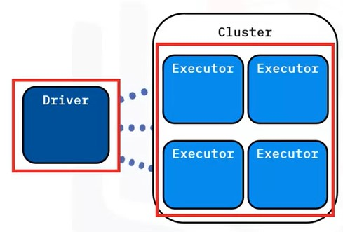
  
  - A Spark Application has two main processes:
    
    - **Driver Program:** a single process that creates work for the cluster
    
    - **Executors:** multiple processes throughout the cluster that do the work in parallel

- What is the Spark Context
  
  - Spark Context:
    
    - Communicates with the Cluster Manager
    
    - Is defined in the Driver, with one Spark Context per Spark Application
    
    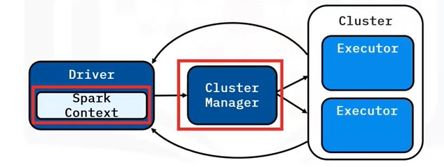

- Spark Jobs
  
  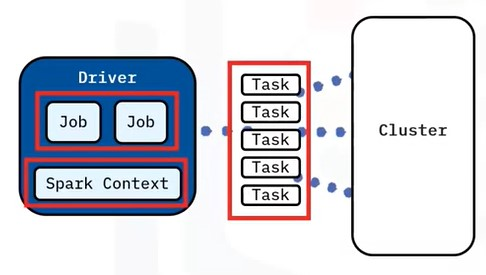
  
  - Jobs are computations that can be executed in parallel
  
  - The Spark Context divides Jobs into Tasks to be executed on the Cluster

- Spark Tasks
  
  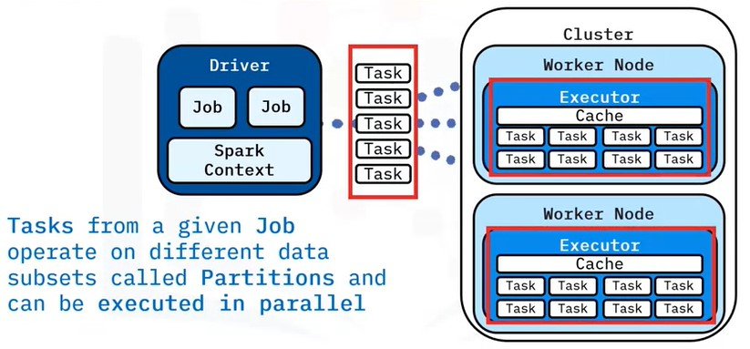

- Spark Executors run tasks from a job
  
  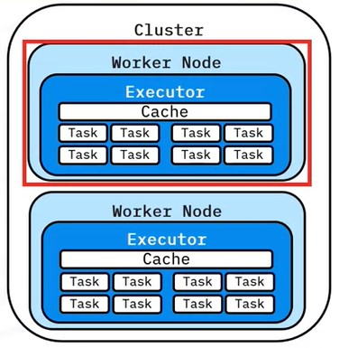
  
  - A **Worker** is a cluster node that can launch executor processes to run tasks
  
  - Each Executor is allotted a set number of cores that each run one task at a time
  
  - Increasing Executors and cores increases cluster parallelism
  
  - Ideally, limit Executor x core combinations to total cores per node.

- Spark Stages and Shuffles
  
  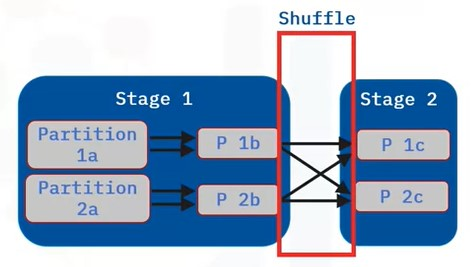
  
  - A `Stage` is a set of tasks within a job that can be completed on the current local data partition
  
  - A `Shuffle` marks the boundary between Stages
  
  - Stages connect to form a dependency graph

- Why Shuffle Data
  
  A Shuffle is:
  
  - Costly - requiring data serialization, disk and network I/O
  
  - Necessary when an operation requires data outside the current partition of the task
  
  - How Spark re-distributes the dataset across the cluster

- Shuffle Example
  
  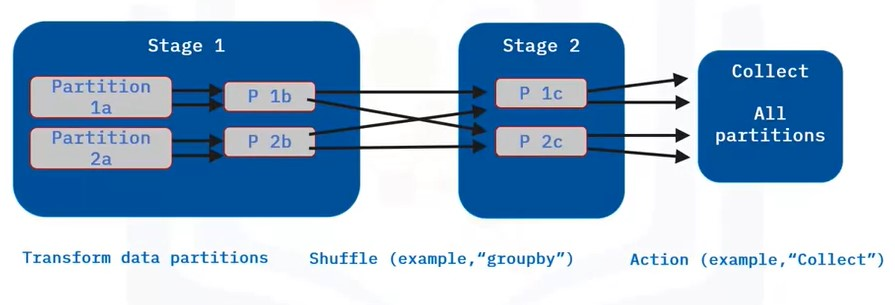

- Apache Spark Architecture
  
  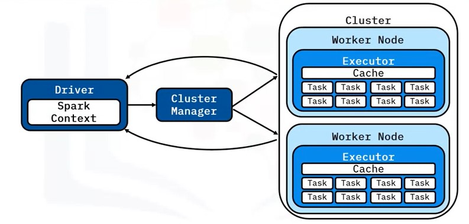

- Driver Deploy Modes
  
  There are two deloy modes:
  
  - Client Mode - the application submitter launches the driver process outside the cluster
  
  - Cluster Mode - the framework launches the driver process inside the cluster

##### Overview of Apche Spark Cluster Modes

- Spark Cluster Manager
  
  - Communicates with a particular cluster to acquire resources for the running application
  
  - Runs as a service outside the application and abstracts the cluster type
    
    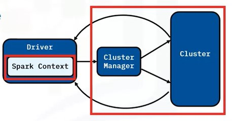

- Type of Cluster Managers
  
  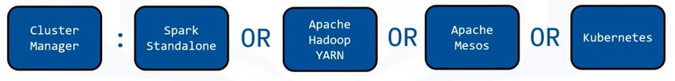
  
  - Spark supports the following cluster managers:
    
    - **Spark Standalone** - comes with Spark, best for setting up a simple cluster
    
    - **Apache Hadoop YARN** (Yet Another Resource Negotiator) - cluster manager from the Hadoop project
    
    - **Apache Mesos** - general-purpose cluster manager with additional benefits
    
    - **Kubernetes** - open-source system for running containerized applications

- Spark Standalone
  
  - Spark Standalone benefits are:
    
    - Built into the Spark installation, so no additional dependencies to deploy
    
    - Fastest way to setup a Spark cluster and get running
    
    - Specifically designed for Spark, not "general-purpose"
  
  - Components:
    
    - *Workers* - run an Executor process to receive tasks
    
    - *Master* - connects and adds workers to the cluster
      
      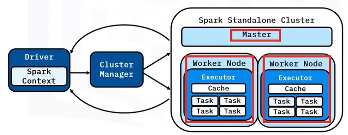
  
  - Set up:
    
    1. Start the Master to output the Master URL
       
       ```bash
       ./sbin/start-master.sh
       ```
    
    2. Start Worker(s) with the Master URL
       
       ```bash
       ./sbin/start-slave.sh spark://<master-spark-URL>:7077
       ```
    
    3. Launch Spark application on cluster by specifying the Master URL
       
       ```bash
       ./bin/spark-submit \
       --master spark://<spark-master-URL>:7077 \
       <additional configuration>
       ```

- Apache Hadoop YARN
  
  - When choosing YARN, consider that it:
    
    - Is general-purpose
    
    - Supports many other big data ecosystem frameworks
    
    - Requires its own configuration and setup
    
    - Has dependencies, making it more complex to deploy than Spark Standalone
      
      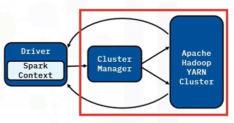
  
  - Set up:
    
    1. Specify the Master option `--master YARN` with 'spark-submit'
       
       ```bash
       ./bin/spark-submit \
       --master YARN \
       <additional configuration>
       ```
    
    2. Spark will automatically connect with YARN using Hadoop configuration

- Apache Mesos
  
  - Apache Mesos Cluster Managers can run Spark with other benefits, such as making partitioning:
    
    - Scalable between many Spark instances
    
    - Dynamic between Spark and other big data frameworks
  
  - Set up: [Running Spark on Mesos - Spark Documentation](https://spark.apache.org/docs/latest/running-on-mesos.html)

- Kubernetes
  
  - K8s cluster managers can run containerized applications, making it easier to:
    
    - Automate deployment
    
    - Simplify dependency management
    
    - Scale the cluster

- Local Mode
  
  - Spark can also be run in local mode which:
    
    - Does not connect to a cluster, making it easy to get started
    
    - Runs in the same process that calls 'spark-submit' and uses threads for running executor tasks
    
    - Can be useful for testing or debugging a Spark application
    
    - Runs a Spark application locally within a single process which can limit performance
  
  - Set up:
    
    - To run Spark in local mode, use the master option `--master local[#]` where `#` specifies the number of cores to use. If `#` is `*` specify using all available cores
      
      ```bash
      # Launch Spark in local mode with 8 cores
      ./bin/spark-submit \
      --master local[8] \
      <additional configuration>
      ```

##### How to Run an Apache Spark Application

- What is 'spark-submit'
  
  'spark-submit' script:
  
  - Spark's Unified Interface for submitting applications
  
  - Found in the 'bin/' directory
  
  - Easily switches from local to cluster mode by changing a single argument
  
  - Works the same way regardless of cluster manager type or application language
    
    ```bash
    ./bin/spark-submit <config and options> <application files>
    ```

- Common 'spark-submit' Options
  
  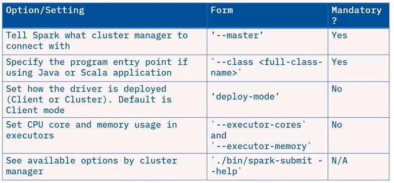

- 'spark-submit' examples
  
  Launch Python SparkPi to a Spark Standalone cluster. Estimate Pi with 1000 samples
  
  ```bash
  # Launching Python SparkPi to a standalone cluster with master at 207.100.100.238
  ./bin/spark-submit \
  --master spark://207.100.100.238:7077 \
  examples/src/main/python/pi.py \
  1000
  ```

- Application Dependencies
  
  - To manage Spark dependencies:
    
    - Bundle projects or libraries with application so they are accessible to driver and executor processes
    
    - For Java or Scala-based programs, create an uber-JAR with application and dependencies together so it is easy to distribute to the cluster

- Python Application Dependencies
  
  - To manage Python application dependencies, ensure:
    
    - Cluster nodes can access the required dependencies with same version
    
    - Same Python version is used
    
    - You use the `--py-files` argument so that `.py`, `.zip` or `.egg` files can be distributed to the cluster
      
      ```bash
      ./bin/spark-submit <config and options> \
      --py-files my_python_package.zip \
      my_pyspark_application.py
      ```

- Spark Shell
  
  - Simple way to learn Spark API
  
  - Powerful tool to analyze data interactively
  
  - Use in local mode or with a cluster, same options as 'spark-submit'
  
  - Can initiate in Scala ('bin/spark-shell') and Python ('bin/pyspark')

#### Monitoring & Tuning

##### The Apache Spark User Interface

- Access the Application UI
  
  1. Start your application
  
  2. Connect to the application UI using the following URL:
     
     `http://<driver-node>:4000`
  
  3. The SparkContext starts a web server for the application UI
     
     - The driver program is the host
     
     - The port defaults to 4040
     
     - The UI is available only while the application is active

- Why use the Application UI
  
  The Spark user interface shows information about the running application:
  
  - Shows jobs, stages and tasks
  
  - Storage of persisted RDDs and DataFrames
  
  - Environment configuration and properties
  
  - Executor summary
  
  - SQL information (if SQL queries exist)

##### Monitoring Application Progress

- Why Monitor an Application
  
  Monitoring an application using the Spark Application UI provides these benefits:
  
  - Quickly identify failed jobs and tasks
  
  - Fast access to locate inefficient operations
  
  - Application workflow optimization

- How do Jobs Progress?
  
  1. Spark jobs divide into stages, which connect as a directed acyclic graph (DAG)
  
  2. Tasks for the current stage are scheduled on the cluster
  
  3. As the stage completes all its tasks, the next dependent stage in the DAG begins
  
  4. The job continues through the DAG until all stages complete
  
  If any tasks within a stage fail, after several attempts, Spark marks the task, stage, and job as failed and stops the application

- Workflow Sequence
  
  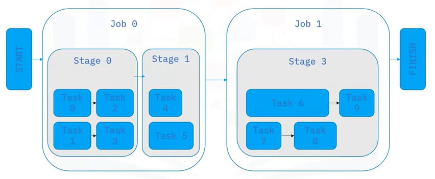

##### Understanding Memory Considerations

- Configuring Spark Process Memory
  
  - Spark applications allow configuration of driver and executor memory
    
    - Upper limit on useable memory enables apps to run without using all available cluster memory
    
    - Exceeding memory requirements causes disk spill or out-of-memory errors

- Memory Setting Considerations
  
  - Executor Memory:
    
    - Processing
    
    - Caching
    
    - Excessive caching leads to issues
  
  - Driver Memory:
    
    - Loads data, broadcasts variables
    
    - Handles results, such as collections

- Spark Unified Memory
  
  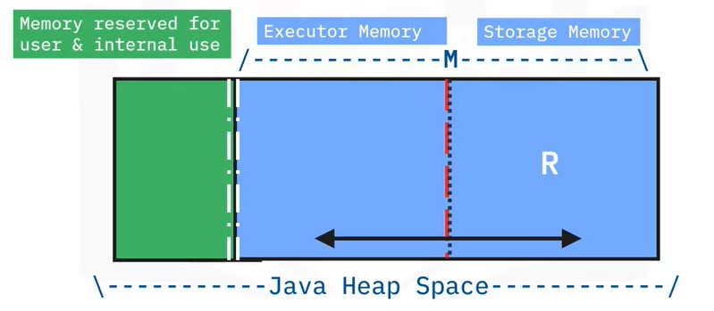
  
  - In Spark, executor memory and storage memory share a unified regions shown in this Java Heap Space in the space labeled M. When no executor memory is used, storage can acquire all the available memory and vice versa.
  
  - Executor memory can evict storage memory if necessary, but only until total storage memory usage falls under a certain threshold. In other words, R describes a subregion within M where cached blocks are never evicted. Storage is not allowed to evict executor memory due to complexities in implementation.
  
  - This design ensures several preferable properties.
    
    -  First, applications that do not use caching can use the entire space for executor memory, obviating unnecessary disk spills.
    
    - Second, applications that do use caching can reserve a minimum storage space, the area labeled R, where their data blocks are immune to being evicted.
    
    - Lastly, this approach provides reasonable out-of-the-box performance for a variety of workloads without requiring user expertise of how memory is divided internally.

- Spark Data Persistence
  
  - Store intermediate calculations
  
  - Persist to memory/disk
  
  - Less computation
  
  - Faster iterations over data

- Setting Memory on Submit
  
  ```bash
  ./bin/spark-submit \
  --class org.apache.spark.examples.SparkPi \
  --master spark://<spark-master-URL>:7077 \
  --executor-memory 10G \
  /path/to/examples.jar \
  1000
  ```

- Setting Worker Node Resources
  
  ```bash
  ./sbin/start-worker.sh \
    spark://<spark-master-URL> \
  --memory 10G --cores 8
  ```

##### Understanding Processor Resources

- CPU Cores as a Spark Resource
  
  - Spark assigns CPU cores to driver and executor
  
  - Parallelism is limited by the number of cores available
  
  - Executors process tasks in parallel up to the number of cores assigned to the application
  
  - After processing, CPU cores become available for future tasks
  
  - Workers in the cluster contain a limited number of cores
  
  - If no cores are available to an application, the application must wait for currently running tasks to finish

- Default CPU Core Usage
  
  - Spark queues tasks and waits for available executors and cores for maximized parallel processing
  
  - Parallel processing tasks mainly depend on the number of data partitions and operations
  
  - Application settings will override default behavior
