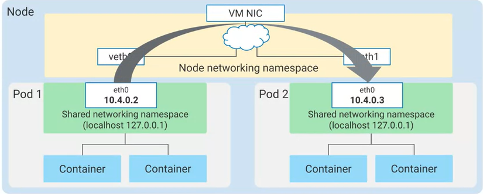

# Kubernetes Tutorial

### Definition

- Open-source platform for managing containerized workloads and services

- Makes it easy to orchestrate many containers on many hosts, scale them as microservices, and deploy rollouts and rollbacks

- Is a set of APIs to deploy containers on a set of nodes called a cluster

- Divided into a set of primary components that run as the control plane and a set of nodes that run containers

- You can decribe a set of applications and how they should interact with each other and Kubernetes figures how to make that happen

### Kubernetes concepts

There are two elements to Kubernetes objects


Containers in a Pod share resources


Desired state compared to current state


### K8s Control Plane

Cooperating processes make a Kubernetes cluster work


- The single component that you interact with directly is called a kube-APIserver. This components job is to accept commands that view or change the state of the cluster, including launching pods. This command's job is to connect to the kube-APIserver and communicate with us using the Kubernetes API. kube-APIserver also authenticates incoming requests, determines whether they are authorized and valid, and manages admission control.

- Etcd is the clusters database. Its job is to reliably store the state of the cluster. This includes all of the cluster configuration data and more dynamic information, such as what nodes are part of the cluster, what pods should be running and where they should be running. You'll never interact directly with etcd, instead kube APIserver interacts with the database on behalf of the rest of the system. 

- Kube-scheduler is responsible for scheduling pods onto nodes. To do that, it evaluates the requirements of each individual pod and selecting which node is most suitable. But it doesn't do the work of actually launching the pods on the nodes. Instead, whenever it discovers a pod object that doesn't yet have an assignment to a node, it chooses a node and simply writes the name of that node into the pod object. Another component of the system is responsible, then for launching to the pods. But how does kube-scheduler decide where to run a pod? It knows the state of all of the nodes and it will obey constraints that you define on where a pod may run, based on hardware, software and policy. For example, you might specify a certain pod is only allowed to run on nodes with a certain amount of memory. You can also define affinity specifications, which caused groups of pods to prefer running on the same node or anti-affinity specifications, which ensure the pods do not run on the same node.

- Kube-controller-manager has a broader job. It continuously monitors the state of the cluster through kubeAPIserver. Whenever the current state of the cluster doesn't match the desired state, kube-controller-manager will attempt to make changes to achieve the desired state. It's called the controller manager because many Kubernetes objects are managed by loops of code called controllers. These loops of code handle the process of re-mediation.

- Kube-cloud manager manages controllers that interact with the underlying cloud providers. For example, if you manually launched a Kubernetes cluster on Google compute engine, kube-cloud manager would be responsible for bringing in Google cloud features like load balancers and storage volumes when you needed them.

- Each node runs a small family of control plane components too. For example, each node runs a kubelet. You can think of a kubelet as Kubernetes agent on each node. When the kube-APIserver wants to start a pod on a node, it connects to that nodes kubelet. Kubelet uses the container runtime to start the pod and monitors its life cycle, including readiness and liveliness probes and reports back to kube-APIserver.

- Kube-proxy's job is to maintain the network connectivity among the pods in the cluster.

### Kubernetes Object Management

Objects are defined in a YAML file

```yaml
apiVersion: apps/v1
kind: Pod
metadata:
    name: nginx
    labels:
        app: nginx
spec:
    containers:
    - name: nginx
      image: nginx:latest
```

**Labels**

- Kubernetes labels are key-value pairs that can connect identifying metadata with Kubernetes objects. Kubernetes offers integrated support for using these labels to query objects and perform bulk operations on selected subsets.

- Label selectors are very expressive. You can ask for all the resources that have a certain value for a label, all those that don't have a certain value, or even all those that have a value in a set you supply.

- *e.g.* `kubectl get pods --selector=app=nginx`

**Controller Objects**

- We can instead declare a controller object whose job is to manage the state of the Pods. Some examples of these objects: Deployments, StatefulSets, DaemonSets, and Jobs.

- Deployments are a great choice for long-lived software components like web servers, especially when we want to manage them as a group. In our example, when kube-scheduler schedules Pods for a Deployment, it notifies the kube-APIserver.

- Deployments ensure that sets of Pods are running

- 

- 

- 

- 

**Namespaces**

- So how do you keep everybody's work on your cluster tidy and organized?  Kubernetes allows you to abstract a single physical cluster into multiple clusters known as 'namespaces'. Namespaces provide scope for naming resources such as Pods, Deployments, and controllers.


- As you can see in this example, there are three namespaces in this cluster: Test, Stage, and Prod. Remember that you cannot have duplicate object names in the same namespace. You can create three Pods with the same name, nginx in this case, but only if they don't share the same namespace.

- If you attempt to create another Pod with the same name 'nginx Pod' in namespace 'test', you won't be allowed. Object names need only be unique within a namespace, not across all namespaces. Namespaces also let you implement resource quotas across the cluster.


- There are three initial namespaces in a cluster. The first is a default namespace, for objects with no other namespace defined. Your workload resources will use this namespace by default.

- Then there is the kube-system namespace for objects created by the Kubernetes system itself. When you use the kubectl command, by default, items in the kube-system namespace are excluded, but you can choose to view its contents explicitly.

- The third namespace is the kube-public namespace for objects that are publicly readable to all users. kube-public is a tool for disseminating information to everything running in a cluster. You're not required to use it, but it can come in handy, especially when everything running in a cluster is related to the same goal and needs information in common.

- Best practice tip: namespace-neutral YAML
  
  - Most flexible: `kubectl -n demo apply -f mypod.yaml`
  
  - Legal but less flexible:
  
  ```yaml
  apiVersion: apps/v1
  kind: Pod
  metadata:
      name: mypod
      namespaces: demo
  ```

**Service**

Services provide load-balanced access to specified Pods. There are three primary types of Services:

- ClusterIP: Exposes the service on an IP address that is only accessible from within this cluster. This is the default type.

- NodePort: Exposes the service on the IP address of each node in the cluster, at a specific port number.

- LoadBalancer: Exposes the service externally, using a load balancing service provided by a cloud provider.

**Other controller objects**

ReplicaSets, Deployments, Replication Controllers, StatefulSets, DaemonSets, Jobs:

- A ReplicaSet controller ensures that a population of Pods, all identical to one another, are running at the same time. Deployments let you do declarative updates to ReplicaSets and Pods. In fact, Deployments manage their own ReplicaSets to achieve the declarative goals you prescribe, so you will most commonly work with Deployment objects.

- Deployments let you create, update, roll back, and scale Pods, using ReplicaSets as needed to do so. For example, when you perform a rolling upgrade of a Deployment, the Deployment object creates a second ReplicaSet, and then increases the number of Pods in the new ReplicaSet as it decreases the number of Pods in its original ReplicaSet.

- Replication Controllers perform a similar role to the combination of ReplicaSets and Deployments, but their use is no longer recommended. Because Deployments provide a helpful "front end" to ReplicaSets.

- If you need to deploy applications that maintain local state, StatefulSet is a better option. A StatefulSet is similar to a Deployment in that the Pods use the same container spec. The Pods created through Deployment are not given persistent identities, however; by contrast, Pods created using StatefulSet have unique persistent identities with stable network identity and persistent disk storage.

- If you need to run certain Pods on all the nodes within the cluster or on a selection of nodes, use DaemonSet. DaemonSet ensures that a specific Pod is always running on all or some subset of the nodes. If new nodes are added, DaemonSet will automatically set up Pods in those nodes with the required specification. The word "daemon" is a computer science term meaning a non-interactive process that provides useful services to other processes. A Kubernetes cluster might use a DaemonSet to ensure that a logging agent like fluentd is running on all nodes in the cluster.

- The Job controller creates one or more Pods required to run a task. When the task is completed, Job will then terminate all those Pods. A related controller is CronJob, which runs Pods on a time-based schedule.

### Kubectl Command

Kubectl is a utility used by administrators to control Kubernetes clusters. You use it to communicate with the kube-apiserver on your control plane. Kubectl transforms your command line entries into API calls that it sends to the kube-apiserver within your selected Kubernetes cluster.

The kubectl command syntax has several parts:


**Introspection**

use kubectl to gather info about  your app:


### Deployment

Deployment declare  the state of the Pods:


Deployment is a two-part process:


Deployment object file in YAML format


### Job and CronJobs

**Job**

A Job is a Kubernetes object, like a Deployment. A Job creates one or more Pods to run a specific task reliably. In its simplest form, a Job will create one Pod and track the task completion within that Pod. When the task is completed, it will terminate the Pod and report that the Job has completed successfully.

There are two main ways to define a Job; non-parallel and parallel:

- Non-parallel Jobs create only one Pod at a time. Of course, that Pod is recreated if it terminates unsuccessfully. These Jobs are completed when the Pod terminates successfully or, if a completion count is defined, when the required number of completions is reached.

- Parallel Jobs are Jobs that have a parallelism value defined, where multiple Pods are scheduled to work on that Job at the same time. If they also have a completion count defined, they are used for tasks that must be completed more than once. Kubernetes considers parallel Job's complete when the number of Pods that have terminated successfully reaches the completion count.


**CronJobs**

Cron format is a commonly adopted syntax used to specify the date and time at which Jobs should be executed and repeated. 


CronJob is a Kubernetes object that creates Jobs in a repeatable manner to a defined schedule. CronJobs are called that because they're named after cron, the standard Unix/Linux mechanism for scheduling a process. The schedule field accepts a time in the Unix/Linux standard format for specifying a CronJob.


### Networking

The kubernetes networking model relies heavily on IP addresses. Services, pods, containers, and nodes communicate using IP addresses and ports. Kubernetes provides different types of load balancing to direct traffic to the correct pods.

**Pod Networking**

A pod is a group of containers with shared storage and networking. This is based on the "IP-per-pod" model of kubernetes. With this model, each pod is assigned a single IP address, and the containers within a pod share the same network namespace, including that IP address.


- For example, you might have a legacy application that uses nginx as a reverse-proxy for client access. The nginx container runs on TCP port 80, and the legacy application runs on TCP port 8000. Because both containers share the same networking namespace, the two containers appear as if they're installed on the same machine. The nginx container will contact the legacy application by establishing a connection to "localhost" on TCP port 8000.

Each pod has a unique IP address, just like the host on a network. On a node, the pods are connected to each other through the node's root network namespace, which ensures that the pods can find and reach each other on that VM. This allows the two pods to communicate on the same node. The root network namespace is connected to the node's primary NIC.



Using the node's VM NIC the root network namespace is able to forward traffic out of the node. This means that the IP addresses on the pods must be routable on the network that the node is connected to.


Pods can connect directly using native IP addresses or using cluster networking likes VPC(GCP or AWS):


#### Services

**Pod vs VM**


- Virtual machines and Pods have very different lifecycles. VMs are typically designed to be durable and persistent through application updates and upgrades, whereas Pods are typically terminated and replaced with newer Pods. 

- As a result of new Pod deployment, the updated containerized version of the application gets a new IP address. Also, if a Pod is rescheduled for any reason, then the Pod gets a new IP address. 

- This unexpected change of addresses could cause significant service disruptions in large, quickly changing environments. Pod IP addresses are ephemeral. Therefore, you need a more dependable way to locate the applications running in your cluster.

- Fortunately, Kubernetes has an answer, Services.

**Services**

- A Kubernetes service is an object that creates a dynamic collection of IP addresses called endpoints that belong to Pods matching the Services labeled selector.
  
  

-  When you create a service, that service issued a static virtual IP address from the pool of IP addresses that the cluster reserves for Services. 
  
  

- The virtual IP is durable. It is published to all nodes in the cluster. It doesn't change even if all the Pods behind it change.

**Service Types and Load Balancers**

There are three principal types of Services: ClusterIP, NodePort and LoadBalancer.  These services build conceptually on one another, adding functionality with each step.

1. **ClusterIP**
   
   - The clusterIP Service is the basis of all the Kubernetes services.
   
   - A Kubernetes ClusterIP Service has a static IP address and operates as a traffic distributor within the cluster. But the ClusterIP Services aren't accessible by resources outside the cluster. Other pods will use this ClusterIP as their destination IP address when communicating with the Service.
   
   - Example:
     
     
     
     - Here, you create a Service object by defining its kind. If you don't specify a Service type during the creation of the service, it will default to Service type of ClusterIP.
     
     - Next, you use a label selector to select the Pods that were on the target application. In this case, the Pods with the label of 'app: Backend' are selected and included as endpoints for this Service.
     
     - You should always create a Service before creating any workloads that need to access that Service. If you create a Service before its corresponding backend workloads, such as Deployments or StatefulSets, the Pods that make up that Service get a nice bonus: they get the hostname and IP address of the Service in an environment variable. But remember that relying on environment variables for Service discovery is not as flexible as using DNS, so this practice isn't mandatory.
     
     - Next, you specify the port that the target containers are using. In this case, it's TCP port 6000. This Service will receive traffic on port 3306 and then remap it to 6000 as it delivers it to the target Pods. Creating, loading, or applying this manifest will create the ClusterIP Service named 'my-service'.
     
     
     
     - In this example, you will have frontend Pods that must be able to locate the backend Pods. When you create the Service, the cluster control plane assigns a virtual IP address, known as ClusterIP, from a reserve pool of alias IP addresses in the cluster's VPC. This IP address won't change throughout the lifespan of the Service. The cluster control plane selects Pods to include in the Service's endpoints based on the label selector on the Service and the labels on the Pods. The IP addresses of these backend Pods are matched to the target port, TCP port 6000 in this example, to create the endpoint resources that the Service forwards requests to. The ClusterIP Service will answer requests on TCP port 3306 in this example, and forward the request to backend Pods using their IP addresses and the target port as the endpoint resources.

2. **NodePort**
   
   - In addition to the setup of a ClusterIP Service, a specific port is exposed on every node. This port is also known as NodePort, and is automatically allocated from the range of 30,000 to 32,767. In some cases, users may want to manually specify it, which is allowed as long as the value falls within that range, but is not usually necessary.
   
   - ClusterIP is useful for internal communication within a cluster, but what about external communication? NodePort enables this. NodePort is built on top of ClusterIP Service, therefore, when you create a NodePort Service, a ClusterIP Service is automatically created in the process.
     
     
   
   - This Service can now be reached from outside of the cluster using the IP address of any node and the corresponding NodePort number. Traffic through this port is directed to a service on port 80 and further directed to one of the backend Pods on port 9376. 
   
   - NodePort Service can be useful to expose a Service to an external load balancer that you setup and manage yourself. Using this approach, you would have to deal with the node management, making sure that there are no collisions.

3. **Load Balancers**
   
   - The LoadBalancer Service type builds on the ClusterIP Service and can be used to expose a Service to resources outside the cluster.
     
     
   
   - The LoadBalancer Service can only run on the environment that support LoadBalancer like cloud environment.
   
   - Example onl Google cloud:
     
     - With GKE, the LoadBalancer Service is implemented using Google Cloud's network load balancer. When you create a LoadBalancer Service, GKE automatically provisions a Google Cloud network load balancer for inbound access to Services from outside the cluster. The traffic will be directed to the IP address of the network load balancer and then the network load balancer forwards the traffic onto the nodes for this Service.
       
       
     
     - You only need to specify the type, LoadBalancer. Google Cloud will assign a static LoadBalancer IP address that is accessible from outside your project. When you specify 'kind: Service' with 'type: LoadBalancer' in the resource manifest, GKE creates a Service of type LoadBalancer. GKE makes appropriate Google Cloud API calls to create either an external network load balancer or an internal TCP/UDP load balancer. GKE creates an internal TCP/UDP load balancer when you add the networking.GKE.io/load-balancer- type: "Internal" annotation; otherwise, GKE creates an external load balancer. You've seen how ClusterIP Services can be used within the cluster to provide a stable endpoint that allows Pods to connect to other Pods without the risk of the IP addresses changing.

**Ingress Resource**

- The Ingress resource operates one layer higher than Services. In fact, it operates a bit like a service for Services. Ingress is not a Service or even a type of Service, it is a collection of rules that direct external inbound connections to a set of Services within the cluster.

- Ingress exposes HTTP and HTTPS routes from outside the cluster to services within the cluster. Traffic routing is controlled by rules defined on the Ingress resource.


- An Ingress may be configured to give Services externally-reachable URLs, load balance traffic, terminate SSL / TLS, and offer name-based virtual hosting. An Ingress controller is responsible for fulfilling the Ingress, usually with a load balancer, though it may also configure your edge router or additional frontends to help handle the traffic.

- Prerequisites: You must have an [Ingress controller](https://kubernetes.io/docs/concepts/services-networking/ingress-controllers) to satisfy an Ingress. Only creating an Ingress resource has no effect. You may need to deploy an Ingress controller such as [ingress-nginx](https://kubernetes.github.io/ingress-nginx/deploy/). You can choose from a number of [Ingress controllers](https://kubernetes.io/docs/concepts/services-networking/ingress-controllers).

- Example:
  
  - ```yaml
    apiVersion: networking.k8s.io/v1
    kind: Ingress
    metadata:
        name: my-Ingress
    spec:
        rules:
        - host: demo.example.com
          http:
            paths:
            -path: /demopath
              backend:
                serviceName: demo1
                servicePort: 80
        - host: lab.user.com
          http:
            paths:
            -path: /labpath
              backend:
                serviceName: lab1
                servicePort: 80
    ```
  
  - 

- Updating an Ingress
  
  - ```bash
    kubectl edit ingress [NAME]
    ```
  
  - ```bash
    kubectl replace -f [FILE]
    ```

#### Network Policy

- A network policy is a set of firewall rules at the Pod level that restrict access to other Pods and Services inside the cluster.

- Example:
  
  ```yaml
  apiVersion: networking.k8s.io/v1
  kind: NetworkPolicy
  metadata:
    name: test-network-policy
    namespace: default
  spec:
    podSelector:
      matchLabels:
        role: db
    policyTypes:
      - Ingress
      - Egress
    ingress:
      - from:
          - ipBlock:
              cidr: 172.17.0.0/16
              except:
                - 172.17.1.0/24
          - namespaceSelector:
              matchLabels:
                project: myproject
          - podSelector:
              matchLabels:
                role: frontend
        ports:
          - protocol: TCP
            port: 6379
    egress:
      - to:
          - ipBlock:
              cidr: 10.0.0.0/24
        ports:
          - protocol: TCP
            port: 5978
  
  ```
  
  - **spec**: NetworkPolicy [spec](https://github.com/kubernetes/community/blob/master/contributors/devel/sig-architecture/api-conventions.md#spec-and-status) has all the information needed to define a particular network policy in the given namespace.
  
  - **podSelector**: Each NetworkPolicy includes a `podSelector` which selects the grouping of pods to which the policy applies. The example policy selects pods with the label "role=db". An empty `podSelector` selects all pods in the namespace.
  
  - **policyTypes**: Each NetworkPolicy includes a `policyTypes` list which may include either `Ingress`, `Egress`, or both. The `policyTypes` field indicates whether or not the given policy applies to ingress traffic to selected pod, egress traffic from selected pods, or both. If no `policyTypes` are specified on a NetworkPolicy then by default `Ingress` will always be set and `Egress` will be set if the NetworkPolicy has any egress rules.
  
  - **ingress**: Each NetworkPolicy may include a list of allowed `ingress` rules. Each rule allows traffic which matches both the `from` and `ports` sections. The example policy contains a single rule, which matches traffic on a single port, from one of three sources, the first specified via an `ipBlock`, the second via a `namespaceSelector` and the third via a `podSelector`.
  
  - **egress**: Each NetworkPolicy may include a list of allowed `egress` rules. Each rule allows traffic which matches both the `to` and `ports` sections. The example policy contains a single rule, which matches traffic on a single port to any destination in `10.0.0.0/24`.

### Install:

- Install docker-desktop

- You can install kubernetes through docker-desktop

- Or you can use "minikube" for run K8s locally

- Install "kubectl"

*check install successful:*

- ```bash
  docker version
  ```

- ```bash
  minikube version
  kubectl version --output=yaml
  ```

### Initialize a cluster:

```bash
minikube start
```

### Check cluster info:

```bash
kubectl cluster-info
```

### Pod:

> *Pods* are the smallest deployable units of computing that you can create and manage in Kubernetes.

##### Run pod:

```bash
kubectl apply -f hello_pod.yaml
```

##### Get pod:

```bash
kubectl get pod
```

```bash
kubectl describe pod
```

```bash
kubectl logs <port_name>
```

In here, if you ran the file "hello_pod.yaml", port_name will be "nginx", run: `kubectl logs nginx`

##### Enter the command line in pod:

```bash
kubectl exec -it <port_name> -- bash
```

##### Mapping port from pod to external:

```bash
kubectl port-forward <port_name> <external_port>:<pod_port>
```

E.g. `kubectl port-forward nginx 8008:80`

Check it: `curl localhost:8080`

##### Delete resource:

```bash
kubectl delete -f hello_pod.yaml
```
