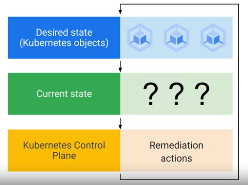

# Kubernetes Tutorial

### Definition

- Open-source platform for managing containerized workloads and services

- Makes it easy to orchestrate many containers on many hosts, scale them as microservices, and deploy rollouts and rollbacks

- Is a set of APIs to deploy containers on a set of nodes called a cluster

- Divided into a set of primary components that run as the control plane and a set of nodes that run containers

- You can decribe a set of applications and how they should interact with each other and Kubernetes figures how to make that happen

### Kubernetes concepts

There are two elements to Kubernetes objects


Containers in a Pod share resources


Desired state compared to current state



### K8s Control Plane

Cooperating processes make a Kubernetes cluster work


- The single component that you interact with directly is called a kube-APIserver. This components job is to accept commands that view or change the state of the cluster, including launching pods. This command's job is to connect to the kube-APIserver and communicate with us using the Kubernetes API. kube-APIserver also authenticates incoming requests, determines whether they are authorized and valid, and manages admission control.

- Etcd is the clusters database. Its job is to reliably store the state of the cluster. This includes all of the cluster configuration data and more dynamic information, such as what nodes are part of the cluster, what pods should be running and where they should be running. You'll never interact directly with etcd, instead kube APIserver interacts with the database on behalf of the rest of the system. 

- Kube-scheduler is responsible for scheduling pods onto nodes. To do that, it evaluates the requirements of each individual pod and selecting which node is most suitable. But it doesn't do the work of actually launching the pods on the nodes. Instead, whenever it discovers a pod object that doesn't yet have an assignment to a node, it chooses a node and simply writes the name of that node into the pod object. Another component of the system is responsible, then for launching to the pods. But how does kube-scheduler decide where to run a pod? It knows the state of all of the nodes and it will obey constraints that you define on where a pod may run, based on hardware, software and policy. For example, you might specify a certain pod is only allowed to run on nodes with a certain amount of memory. You can also define affinity specifications, which caused groups of pods to prefer running on the same node or anti-affinity specifications, which ensure the pods do not run on the same node.

- Kube-controller-manager has a broader job. It continuously monitors the state of the cluster through kubeAPIserver. Whenever the current state of the cluster doesn't match the desired state, kube-controller-manager will attempt to make changes to achieve the desired state. It's called the controller manager because many Kubernetes objects are managed by loops of code called controllers. These loops of code handle the process of re-mediation.

- Kube-cloud manager manages controllers that interact with the underlying cloud providers. For example, if you manually launched a Kubernetes cluster on Google compute engine, kube-cloud manager would be responsible for bringing in Google cloud features like load balancers and storage volumes when you needed them.

- Each node runs a small family of control plane components too. For example, each node runs a kubelet. You can think of a kubelet as Kubernetes agent on each node. When the kube-APIserver wants to start a pod on a node, it connects to that nodes kubelet. Kubelet uses the container runtime to start the pod and monitors its life cycle, including readiness and liveliness probes and reports back to kube-APIserver.

- Kube-proxy's job is to maintain the network connectivity among the pods in the cluster.

### Kubernetes Object Management

Objects are defined in a YAML file

```yaml
apiVersion: apps/v1
kind: Pod
metadata:
    name: nginx
    labels:
        app: nginx
spec:
    containers:
    - name: nginx
      image: nginx:latest

```

**Labels**

- Kubernetes labels are key-value pairs that can connect identifying metadata with Kubernetes objects. Kubernetes offers integrated support for using these labels to query objects and perform bulk operations on selected subsets.

- Label selectors are very expressive. You can ask for all the resources that have a certain value for a label, all those that don't have a certain value, or even all those that have a value in a set you supply.

- *e.g.* `kubectl get pods --selector=app=nginx`

**Controller Objects**

- We can instead declare a controller object whose job is to manage the state of the Pods. Some examples of these objects: Deployments, StatefulSets, DaemonSets, and Jobs.

- Deployments are a great choice for long-lived software components like web servers, especially when we want to manage them as a group. In our example, when kube-scheduler schedules Pods for a Deployment, it notifies the kube-APIserver.

- Deployments ensure that sets of Pods are running

- 

- 

- 

- 

**Namespaces**

- So how do you keep everybody's work on your cluster tidy and organized?  Kubernetes allows you to abstract a single physical cluster into multiple clusters known as 'namespaces'. Namespaces provide scope for naming resources such as Pods, Deployments, and controllers.


- As you can see in this example, there are three namespaces in this cluster: Test, Stage, and Prod. Remember that you cannot have duplicate object names in the same namespace. You can create three Pods with the same name, nginx in this case, but only if they don't share the same namespace.

- If you attempt to create another Pod with the same name 'nginx Pod' in namespace 'test', you won't be allowed. Object names need only be unique within a namespace, not across all namespaces. Namespaces also let you implement resource quotas across the cluster.


- There are three initial namespaces in a cluster. The first is a default namespace, for objects with no other namespace defined. Your workload resources will use this namespace by default.

- Then there is the kube-system namespace for objects created by the Kubernetes system itself. When you use the kubectl command, by default, items in the kube-system namespace are excluded, but you can choose to view its contents explicitly.

- The third namespace is the kube-public namespace for objects that are publicly readable to all users. kube-public is a tool for disseminating information to everything running in a cluster. You're not required to use it, but it can come in handy, especially when everything running in a cluster is related to the same goal and needs information in common.

- Best practice tip: namespace-neutral YAML
  
  - Most flexible: `kubectl -n demo apply -f mypod.yaml`
  
  - Legal but less flexible:
  
  ```yaml
  apiVersion: apps/v1
  kind: Pod
  metadata:
      name: mypod
      namespaces: demo
  ```

### Install:

- Install docker-desktop

- You can install kubernetes through docker-desktop

- Or you can use "minikube" for run K8s locally

- Install "kubectl"

*check install successful:*

- ```bash
  docker version
  ```

- ```bash
  minikube version
  kubectl version --output=yaml
  ```

### Initialize a cluster:

```bash
minikube start
```

### Check cluster info:

```bash
kubectl cluster-info
```

### Pod:

> *Pods* are the smallest deployable units of computing that you can create and manage in Kubernetes.

##### Run pod:

```bash
kubectl apply -f hello_pod.yaml
```

##### Get pod:

```bash
kubectl get pod
```

```bash
kubectl describe pod
```

```bash
kubectl logs <port_name>
```

In here, if you ran the file "hello_pod.yaml", port_name will be "nginx", run: `kubectl logs nginx`

##### Enter the command line in pod:

```bash
kubectl exec -it <port_name> -- bash
```

##### Mapping port from pod to external:

```bash
kubectl port-forward <port_name> <external_port>:<pod_port>
```

E.g. `kubectl port-forward nginx 8008:80`

Check it: `curl localhost:8080`

##### Delete resource:

```bash
kubectl delete -f hello_pod.yaml
```
