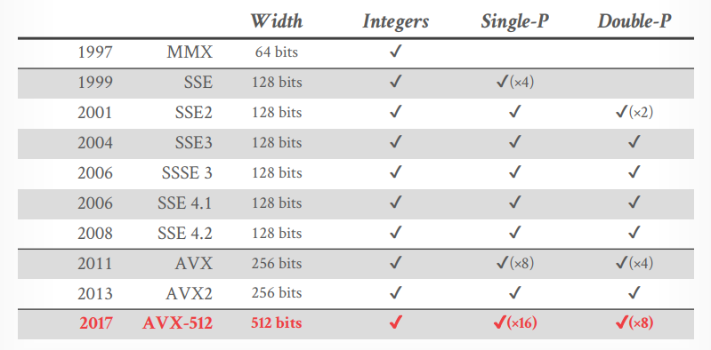
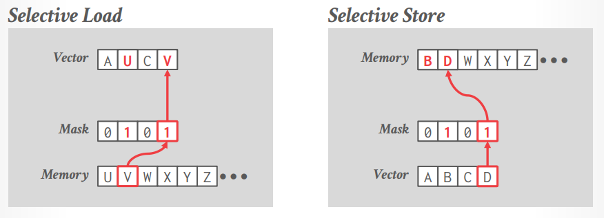
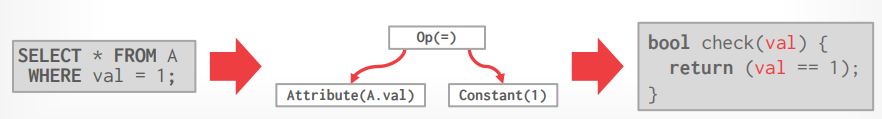

### Modern Analytical Database System

### OLAP Commoditization

One recent trend of the last decade is the breakout OLAP engine sub-systems into standalone open-source components.

- This is typically done by organizations not in the business of selling DBMS software.

###### Examples:

- System Catalogs

- Query Optimizers

- File Format/ Access Libraries

- Execution Engines

#### System Catalogs

A DBMS tracks a database's schema (table, columns) and data files in its catalog.

- If the DBMS is on the data ingestion path, then it can maintain the catalog incrementally.

- If an external process adds data files, then it also needs to update the catalog so that the DBMS is aware of them.

Noteable implementations:

- HCatalog

- Google Data Catalog

- Amazon Glue Data Catalog

#### Query Optimizers

Extendible search engine framework for heuristic and cost-based query optimization.

- DBMS provides transformation rules and cost estimates.

- Framework returns either a logical or physical query plan.
  
  **This is the hardest part to build in any DBMS.**

Noteable implementations:

- Greenplum Orca

- Apache Calcite

#### File Formats

Most DBMS use a proprietary on-disk binary file format for their databases. The only way to share data between systems is to convert data into a common text-based format

- Examples: CSV, Json, XML

There are open-source binary file formats that make it easier to access data across systems and libraries for extracting data from files.

- Libraries provide an iterator interface to retrive (batched) columns from files.

- Examples: Parquet, Arrow, ...

#### Execution Engines

Standalone libraries for executing vectorized query operators on columnar data.

- Input is a DAG of physical operators.

- Require external scheduling and orchestration.

Noteable implementations:

- Velox

- DataFusion

- Intel OAP

---

### Analytical Database Indexes

#### Observation

OLTP DBMSs use indexes to find individual tuples without performing sequential scans.

- Tree-based indexes (B+Trees) are meant for queries with low selectivity predicates.

- Alse need to accommodate incremental updates.

But OLAP queries don't necessarily need to find individual tuples and data files are read-only.

How can we speed up sequential scans?

#### Sequential Scan Optimizations

Data Prefetching

Task Parallelization / Multi-threading

Clustering / Sorting

Late Materialization

Materialized Views / Result Caching

Data Skipping

Data Parallelization / Vectorization

Code Specialization / Compilation

#### Data Skipping

Approach #1: Approximate Queries (Lossy)

- Execute queries on a sampled subset of the entire table to produce approximate results.

- Examples: BlinkDB, Redshift, ComputeDB, ...

Approach #2: Data Pruning (Loseless)

- Use auxiliary data structures for evaluating predicates to quickly identify portions of a table that the DBMS can skip instead of examining tuples individually.

- DBMS must consider trade-offs between `scope` vs. `filter efficacy`, `manual` vs. `automatic`.

#### Data Considerations

Predicate Selectivity

- How many tuples will satisfy a query's predicates.

Skewness

- Whether an attribute has all unique values or contain many repeated values.

Clustering /  Sorting

- Whether the table is pre-sorted on the attributes accessed in a query's predicates.

#### Zone Maps

Pre-computed aggregates for the attribute values in  a block of tuples. DBMS checks the zone map first to decide whether it wants to access the block.

- Originally called **Small Materialized Aggregates (SMA)**

- DBMS automatically creates/maintains this meta-data.

Examples:

*Original Data*

| val |
|:---:|
| 100 |
| 200 |
| 300 |
| 400 |

=> *Zone Map*

| type    | val  |
|:-------:|:----:|
| *MIN*   | 100  |
| *MAX*   | 400  |
| *AVG*   | 250  |
| *SUM*   | 1000 |
| *COUNT* | 4    |

Trade-off between scope vs. filter efficacy

- If the scope is too large, the the zone maps will be useless.

- If the scope is too small, then the DBMS will spend too much checking zone maps.

Zone Maps are only useful when the target attribute's position and values are correlated.

#### Bitmap Indexes

Store a separate Bitmap for each unique value for an attribute where an offset in the vector corresponds to a tuple.

- The iᵗʰ position in the Bitmap corresponds to the iᵗʰ tuple in the table.

Typically segmented into chunks to avoid allocating large blocks of contiguous memory.

- Example: One per row group in PAX.

###### Bitmap Index: Design Choices

Encoding Scheme

- How to represent and organize data in a Bitmap.

Compression

- How to reduce the size of sparse Bitmaps.

###### Bitmap Index: Encoding

Approach #1: Equality Encoding

- Basic scheme with one Bitmap per unique value.

Approach #2: Range Encoding

- Use one Bitmap per interval instead of one per value.

- Example: PostgreSQL BRIN

Approach #3: Hierarchical Encoding

- Use a tree to identify empty key ranges.

Approach #4: Bit-sliced Encoding

- Use a Bitmap per bit location across all values.

---

### Database Compression

#### Observation

I/O is (traditionally) the main bottleneck during query execution. If the DBMS still needs to read data, we need to ensure that it maximizes the amount of useful information it can extract from it.

Key trade-off is **speed** vs. **compression ratio**

- Compressing the data reduces DRAM requirements and processing.

Database compression: Reduce the size of the database physical representation to increase the # of values accessed and processed per unit of computation or I/O.

Goal #1: Must produce fixed-length values.

Goal #2: Must be a lossless scheme.

Goal #3: Ideally postpone decompression for as long as possible during query execution.

#### Lossless vs. lossy compression

When a DBMS uses compression, it is always lossless because people don't like losing data.

Any kind of lossy compression must be performed at the application level.

Reading less than the entire data set during query execution is sort of like of compression.

- Approximate Query Processing

#### Compression Granularity

Choice #1: Block-level

- Compress a block (e.g., database page, RowGroup) of tuples in a table.

Choice #2: Tuple-level

- Compress the contents of the entire tuple(NSM-only).

Choice #3: Attribute-level

- Compress a single attribute value within one tuple.

- Can target multiple attributes for the same tuple.

Choice #4: Column-level

- Compress multiple values for one or more attributes stored for multiple tuples (DSM-only).

*NSM stand for N-ary Storage Model, DSM stand for Decomposition Storage Model*

#### Naive Compression

Compress data using a general-purpose algorithm. Scope of compression is only based on the data provided as input. (Snappy, Zstd, ...)

Considerations:

- Computational overhead

- Compress vs. decompress speed

The DBMS must decompress data first before it can be read and (potentially) modified.

- Even if the algo uses dictionary compression, the DBMS cannot access the dictionary's contents.

- This limits the practical scope of the compression scheme.

These schemes alse do not consider the high-level meaning or semantics of the data.

#### Columnar Compression

Run-length Encoding

Dictionary Encoding

Bitmap Encoding

Delta Encoding

Bit Packing

#### Run-length Encoding

Compress runs of the same value in a single column into triplets:

- The value of the attribute.

- The start position in the column segment.

- The # of elements in the run.

Requires the columns to be sorted intelligently to maximize compression opportunities.

Sometimes alse called *null suppression* if the DBMS only tracks empty space.

#### Dictionary Compression

Replace frequent values with smaller fixed-length codes and then maintain a mapping (dictionary) from the codes to the original values

- Typically, one code per attribute value.

- Most widely used native compression scheme in DBMSs.

The ideal dictionary scheme supports fast encoding and decoding for both point and range queries.

###### Dictionary Construction

Choice #1: All-At-One

- Compute the dictionary for all the tuples at a given point of time.

- New tuples must use a separate dictionary, or the all tuples must be recomputed.

- This is easy to do if the file is immutable.

Choice #2: Incremental

- Merge new tuples in with an existing dictionary.

- Likely requires re-encoding to existing tuples.

###### Dictionary Scope

Choice #1: Block-level

- Only include a subset of tuples within a single table.

- DBMS must decompress data when combining tuples from different block (e.g., hash table for joins).

Choice #2: Table-level

- Construct a dictionary for the entire table.

- Better compression ratio, but expensive to update.

Choice #3: Multi-table

- Can be either subset or entire tables.

- Sometimes helps with joins and set operations.

###### Encoding / Decoding

Encode/Locate: For a given uncompressed value, convert it into its compressed form.

Decode/Extract: For a given compressed value, convert it back into its original form,

No magic hash function will do this for us.

Order-preserving ending:

- The encoded values need to support sorting in the same order as original values.

###### Dictionary Data Structures

Choice #1: Array

- Only array of variable length strings and another array with pointers that maps to string offsets.

- Expensive to update so only usable in immutable files.

Choice #2: Hash Table

- Fast and compact.

- Unable to support range and prefix queries.

Choice #3: B+Tree

- Slower than a hash table and takes more memory.

- Can support range and prefix queries.

###### Dictionary: Array

First sort the values and then store them sequentially in a byte array.

- Need to also store the size of the value if they are variable-length.

Replace the original data with dictionary codes that are the (byte) offset into this array.

###### Exposing Dictionary to DBMS

Parquet/ORC do not provide an API to directly access a file's compression dictionary.

This means the DBMS cannot perform predicate pushdown and operate directly on compressed data before decompressing it.

Google's Artus proprietary format for Procella supports this.

###### Bitmap Encoding

Using bitmaps to represent a column can reduce its storage size if the column's cardinality is low.

###### Bitmap Index: Compression

Approach #1: General Purpose Compression

- Use standard compression algorithms (e.g., Snappy, zstd).

- Must decompress entire data chunk before DBMS can use it to process a query.

Approach #2: Byte-aligned Bitmap Codes

- Structured run-length encoding compression.

Approach #3: Roaring Bitmaps

- Modern hybrid of run-length encoding and value lists.

###### ORACLE Byte-aligned Bitmap Codes

Divide bitmap into chunks that contain different categories of bytes:

- **Gap Byte**: All the bits are **0**s.

- **Tail Byte**: Some bits are **1**s.

Encode each **chunk** that consists of some **Gap Bytes** followed by some **Tail Bytes**.

- Gap Bytes are compressed with RLE. (Run-length Encoding)

- Tail Bytes are stored uncompressed unless it consists of only 1-byte or has only one non-zero bit.

###### Observation

Oracle's BBC is an obsolete format.

- Although it provides good compression, it is slower than recent alternatives due to excessive branching,

- Word-Aligned Hybrid (WAH) encoding is a patented variation on BBC that provides better performance.

None of these support random access.

- If you want to check whether a given value is present, you must start from the beginning and decompress the whole thing.

###### Roaring Bitmaps

Store 32-bit integers in a compact two-level indexing data structure.

- Dense chunks are stored using bitmaps.

- Sparse chunks use packed arrays of 16-bit integers.

Used in Lucene, Hive, Spark, Pinot.


###### Delta Encoding

Recording the difference between values that follow each other in the same column.

- Store base value in-line or  in a separate look-up table.

- Combine with RLE to get event better compression ratios.


###### Bit Packing

If the values for an integer attribute is smaller than the range of its given data type size, then reduce the number of bits to represent each value.

Use bit-shifting tricks to operate on multiple values in a single word.

- Like in BitWeaving/Vertical.


###### Mostly Encoding

A variation of bit packing for when an attribute's values are "mostly" less than the largest size, store them with smaller data type.

- The remaining values that cannot be compressed are stored in their raw form.


#### Intermediate Results

After the evaluating a predicate on compressed data, the DBMS will decompress it as it moves from the scan operator to the next operator.

- Example: Execute a hash join on two tables that use different compression schemes.

The DBMS (typically) does not recompress data during query execution. Otherwise, the system needs to embed decompression logic throughout the entire execution engine.

Dictionary encoding is not always the most effective compression scheme, but it is the most used.

The DBMS can combine different approaches for even better compression.

---

### Query Execution & Processing Models

#### Execution Optimization

DBMS engineering is an orchestration of a bunch of optimizations that seek to make full use of hardware. There is not a single technique that is more important than others.

Top-3 Optimizations:

- Data Parallelization (Vectorization)

- Task Parallelization (Multi-threading)

- Code Specialization (Compilation)

#### Optimization Goals

- Approach #1: Reduce Instruction Count
  
  - Use fewer instructions to do the same amount of work.

- Approach #2: Reduce Cycles per Instruction
  
  - Execute more CPU instructions in fewer cycles.

- Approach #3: Parallelize Execution
  
  - Use multiple threads to compute each query in parallel.

#### Query Execution

A query plan is a  DAG of `operators`.

An `operator instance` is an invocation of an  operator on a unique segment of data.

A `task` is a sequence of one or more operator instances (also sometimes referred to as a `pipeline`).


#### CPU Overview

CPUs organize instructions into `pipeline stages`.

The goal is to keep all parts of the processor busy at each cycle by masking delays from instructions that cannot complete in a single cycle.

Super-scalar CPUs support multiple pipelines.

- Execute multiple instructions in parallel in a single cycle if they are independent (out-of-order execution).

Everything is fast until there is a mistake...

##### DBMS / CPU Problems

Problem #1: Dependencies

- If one instruction depends on another instruction, then it cannot be pushed immediately into the same pipeline.

Problem #2: Branch Prediction

- The CPU tries to predict what branch the program will take and fill in the pipeline with its instructions.

- If it gets it wrong, it must throw away any speculative work and flush the pipeline.

##### Branch Misprediction

Because of long pipelines, CPU will speculatively execute branches. This potentially hides the long stalls between dependent instructions.

The most executed branching code in a DBMS is the filter operation during a sequential scan. But this is (nearly) impossible to predict correctly.

##### Selection Scans

From a example:

```sql
SELECT * FROM table
WHERE key > $(low) AND key < $(high)
```

- Scalar (Branching):
  
  ```python
  i = 0
  for t in table:
      key = t.key
      if (key>low) && (key<high):
          copy(t, output[i])
          i = i + 1
  ```

- Scalar (Branchless):
  
  ```python
  i = 0
  for t in table:
      copy(t, output[i])
      key = t.key
      delta = key>low ? 1 : 0) & (key<high ? 1 : 0)
      i = i + delta
  ```

`Note`: Use branchless for better performances.

#### Excessive Instructions

The DBMS needs to support different data types, so it must check a values type before it performs any operation on that value.

- This is usually implemented as giant switch statements.

- Also creates more branches that can be difficult for the CPU to predict reliably.

Example: Postgres addition for `NUMERIC` types.

#### Processing Model

A DBMS's `processing model` defines how the system executes a query plan.

- Different trade-offs for workloads (OLTP vs. OLAP).

Approach #1: **Iterator Model**

Approach #2: **Materialization Model**

Approach #3: **Vectorized / Batch Model**

###### Iterator Model

Each query plan operator implements a *next* function.

- On each invocation, the operator returns either a single tuple or a null marker if there are no more tuples.

- The operator implements a loop that calls next on its children to retrieve their tuples and then process them.

Also called *Volcano* or *Pipeline* Model.

Example flow:


This is used in almost every DBMS. Allows for tuple **pipelining**.

Some operators must block until their children emit all their tuples.

- Joins, Subqueries, Order By

Output control works easily with this approach.

###### Materialization Model

Each operator processes its input all at once and then emits its output all at one.

- The operator "materializes" its output as a single result.

- The DBMS can push down hints (e.g., LIMIT) to avoid scanning too many tuples.

- Can send either a materialized row or a single column.

The output can be either whole tuples (NSM) or subsets of columns (DSM).

Example flow:


Better for OLTP workloads because queries only access a small number of tuples at a time.

- Lower execution / coordination overhead.

- Fewer function calls.

Not good for OLAP queries with large intermediate results.

###### Vectorization Model

Like the Iterator Model where each operator implements a `next` function, but...

Each operator emits a **batch** of tuples instead of a single tuple.

- The operator's internal loop processes multiple tuples at a time.

- The size of the batch can vary based on hardware or queries properties.

Example flow:


Ideal for OLAP queries because it greatly reduces the number of invocations per operator.

Allows for operators to more easily use vectorized (SIMD) instructions to process batches of tuples.

#### Plan Processing Direction

**Approach #1: Top-to-Bottom (Pull)**

- Start with the root and "pull" data up from its children.

- Tuples are always passed with function calls.

**Approach #2: Bottom-to-Top (Push)**

- Start with leaf nodes and "push" data to their parents.

##### Push-Based Iterator Model


##### Plan Processing Direction

**Approach #1: Top-to-Bottom (Pull)**

- Easy to control output via `LIMIT`.

- Parent operator blocks until its child returns with a tuple.

- Additional overhead because operators' `next` functions are implemented as virtual functions.

- Branching costs on each `next` invocation.

**Approach #2: Bottom-to-Top (Push)**

- Allows for tighter control of caches/registers in pipelines.

- Difficult to control output via `LIMIT`.

- Difficult to implement Sort-Merge Join.

#### Parallel Execution

The DBMS executes multiple tasks simultaneously to improve hardware utilization.

- Active tasks do not need to belong to the same query.

**Approach #1: Inter-Query Parallelism**

**Approach #2: Intra-Query Parallelism**

##### Inter-Query Parallelism

Improve overall proformance by allowing multiple queries to execute simultaneously.

- Most DBMSs use a simple first-come, first-served policy.

OLAP queries have parallelizable and non-parallelizable phases. The goal is to always keep all cores active.

##### Intra-Query Parallelism

Improve the performance of a single query by executing its operators in parallel.

**Approach #1: Intra-Operator (Horizontal)**

**Approach #2: Inter-Operator (Vertical)**

These techniques are not mutually exclusive.

There are parallel algorithms for every relational operator.

##### Intra-Operator Parallelism

**Approach #1: Intra-Operator (Horizontal)**

- Operators are decomposed into independent instances that perform the same function on different subsets of data.

The DBMS inserts an `exchange` operator into the query plan to coalesce results from children operators.


##### Inter-Operator Parallelism

**Approach #2: Inter-Operator (Vertical)**

- Operations are overlapped in order to pipeline data from one stage to the next without materialization.

- Workers execute multiple operators from different segments of a query plan at the same time.

- Still need exchange operators to combine intermediate results from segments.

Also called **pipelined parallelism**.


---

### Query Scheduling

#### Scheduling

For each query plan, the DBMS must provide where, when, and how to execute it.

- How many tasks should it use?

- How many CPU cores should it use?

- What CPU core should the tasks execute on?

- Where should a task store its output?

The DBMS *always* knows more than the OS.

##### Scheduling Goals

**Goal #1: Throughput**

- Maximize the # of completed queries.

**Goal #2: Fairness**

- Ensure that no query is starved for resources.

**Goal #3: Query Responsiveness**

- Minimize tail latencies (especially for short queries)

**Goal #4: Low Overhead**

- Workers should spend most of their time executiong tasks not figuring out what task to run next.

##### Process Model

A DBMS's **process model** defines how the system is architected to support concurrent requests from a multi-user application.

A **worker** is the DBMS component that is responsible for executing tasks on behalf of the client and returning the results.

We will assume that the DBMS is multi-threaded.

##### Worker Allocation

**Approach #1: One Worker per Core**

- Each core is assigned one thread that is pinned to that core in the OS.

- See [sched_setaffinity](https://man7.org/linux/man-pages/man2/sched_setaffinity.2.html).

**Approach #2: Multiple Workers per Core**

- Use a pool of workers per core (or per socket).

- Allows CPU cores to be fully utilized in case one worker at a core blocks.

##### Task Assignment

**Approach #1: Push**

- A centralized dispatcher assigns tasks to workers and monitors their progress.

- When the worker notifies the dispatcher that it is finished it is given a new task.

**Approach #2: Pull**

- Workers pull the next task from a queue, process it, and then return to get the next task.

*Notes:*

- Regardless of what worker allocation or task assignment policy the DBMS uses, it's important that workers operate on local data.

- The DBMS's scheduler must be aware of its hardware memory layout.
  
  - Uniform vs. None-Uniform Memory Access

**Uniform Memory Access (Used in Old Systems)**


**Non-Uniform Memory Access (Used in Modern Systems)**


#### Data Placement

The DBMS can partition memory for a database and assign each partition to a CPU.

By controlling and tracking the location of partitions, it can schedule operators to execute on workers at the closest CPU core.

See Linux’s [move_pages](https://man7.org/linux/man-pages/man2/move_pages.2.html) and [numactl](https://linux.die.net/man/8/numactl)

##### Memory Allocation

What happens when the DBMS calls `malloc`?

- Assume that the allocator doesn't already have a chunk of memory that it can give out.

Almost nothing:

- The allocator will extend the process' data segment.

- But this new virtual memory is not immediately backed by physical memory.

- The OS only allocates physical memory when there is a page fault on access.

Now after a page fault, where does the OS allocate physical memory in a NUMA (Non-Uniorm Memory Access) system?

##### Memory Allocation Location

**Approach #1: Interleaving**

- Distribute allocated memory uniformly across CPUs.

**Approach #2: First-Touch**

- At the CPU of the thread that accessed the memory location that caused the page fault.

The OS can try to move memory to another NUMA region from observed access patterns.


##### Partitioning Vs. Placement

A **partitioning** scheme is used to split the database based on some policy.

- Round-robin

- Attribute Ranges

- Hashing

- Partial/Full Replication

A **placement** scheme then tells the DBMS where to put those partitions.

- Round-robin

- Interleave across cores

###### Observation

We have the following so far:

- Task Assigment Model

- Data Placement Policy

But how to we decide how to create a set of tasks from a logical query plan?

- This is relatively easy for OLTP queries. (because it's maybe one pipeline, one task to assign to a worker and be done with it)

- Much harder for OLAP queries... (the queries can be more complicated and can depencencies between these tasks or these pipelines)

##### Static Scheduling

The DBMS decides how many threads to use to execute the query when it generates the plan.

It does *not* change while the query executes.

- The easiest approach is to just use the same # of tasks as the # of cores.

- Can still assign tasks to threads based on data location to maximize local data processing.

##### Morsel-Driven Scheduling

Dynamic scheduling of tasks that operate over horizontal partitions called "morsels" distributed across cores.

- One worker per core.

- One morsel per task.

- Pull-based task assignment.

- Round-robin data placement.

Supports parallel, NUMA-aware operator implementations.

###### Hyper - Architecture

No separate dispatcher thread.

The workers perform cooperative scheduling for each query plan using a single task queue.

- Each worker tries to select tasks that will execute on morsels that are local to it.

- If there are no local tasks, then the worker just pulls the next task from the global work queue.

###### Hyper - Data Partitioning


###### Hyper - Execution Example

- Morsel read their local data to build a hash table:
  
  

- Morsel write it to Buffer Memory:
  
  

- Wait for all tasks are done:
  
  

- Execute the next one:
  
  

- Say this one guy finishes:
  
  

- then it goes up this Global task queue and it can pick another task run, if there's no task that prefers or wants to run on this new region, we pulled out, poach it, steal it and actually run it:
  
  

Because there is only one worker per core and one morsel per task, HyPer must use work stealing because otherwise threads could sit idle waiting for stragglers.

The DBMS uses a lock-free hash table to maintain the global work queues.

Tasks can be have different execution costs per tuple.

- Example: Simple Selection vs. String Matching.

HyPer also has no notion of execution priorities.

- All query tasks are executed with the same.

- Short-running queries get blocked behind long-running queries.

##### UMBRA - Morsel Scheduling 2.0

Tasks are not created statically at runtime.

Each task may contain multiple morsels.

Modern implementation of stride scheduling.

Priority decay.

###### UMBRA - Stride Scheduling

Each worker maintains its own thread-local meta-data about the available tasks to execute.

- **Active Slots:** Which entries in the global slot array have active task sets available.

- **Change Mask:** Indicates when a new task set is added to the global slot array.

- **Return Mask:** Indicates when a worker completes a task set.

Workers perform CaS updates to TLS meta-data to broadcast changes.


- When a worker completes the last morsel for a query's active task set:


- It inserts the next task set into global slot array:


- And updates the return mask for all workers:
  
  

##### SAP HANA - NUMA-Aware Scheduler

Pull-based scheduling with multiple worker threads that are organized into groups (pools).

- Each CPU can have multiple groups.

- Each group has a soft and hard priority queue.

Uses a seperate "watchdog" thread to check whether groups are saturated and can reassign tasks dynamically.

##### SAP HANA - Thread Groups

DBMS maintain `soft` and `hard` priority task queues for each thread group.

- Threads can steal tasks from other group's soft queues.

Four different pools of thread per group:

- **Working:** Active executing a task.

- **Inactive:** Blocked inside of the kernel due to a latch.

- **Free:** Sleeps for a little, wake up to see whether there is a new task to execute.

- **Parked:** Waiting for a task (like a free thread) but blocked in the kernel until the watchdog thread wakes it up.

##### SAP HANA - NUMA-Aware Scheduler

Dynamically adjust thread pinning based on whether a task is CPU or memory bound.

- Allow more cross-region stealing if DBMS is CPU-bound.

SAP found that work stealing was not as beneficial for systems with a larger number of sockets.

- HyPer (2-4 sockets) vs. HANA (64 sockets)

Using thread groups allows cores to execute other tasks instead of just only queries.

Example:


In the above example, the first tasks we want to execute go to the `Soft Queue`. And the garbage collector that we wanted this only run on local memory, we'll put these to the `Hard Queue` and this will prevent anybody from stealing them.

Now our working threads can wake up and they go pull things out of `Soft Queue` and can start running:


Other threads are waiting for some latch.

The free threads will wake up and it'll look in these queues and finds something in the `Hard Queue`:


So then it changes into the working pool and it can execute:


##### SQL Server - SQLOS

**SQLOS** is a user-mode NUMA-aware OS layer that runs inside of the DBMS and manages provisioned hardware resources.

- Determines which tasks are scheduled onto which threads.

- Also manages I/O scheduling and higher-level concepts like logical database locks.

Non-preemptive thread scheduling through instrumented DBMS code.

**SQLOS** quantum is 4ms but the scheduler cannot enforce that.

```sql
SELECT * FROM R WHERE R.val = ?
```

Approximate Plan:

```python
for t in R:
    if eval(predicate, tuple, params):
        emit(tuple)
```

DBMS developers must add explicit `yield` calls in various locations in the source code.

```python
last = now()
for tuple in R:
    if now() - last > 4ms:
        yield # this is the different for yield
        last = now()
    if eval(predicate, tuple params):
        emit(tuple)
```

Other Examples:

- ScyllaDB

- FaunaDB

- CoroBase

#### Observation

- If requests arrive at the DBMS faster than it can execute them, then the system becomes overloaded.

- The OS cannot help us here because it does not know what threads are doing:
  
  - CPU Bound: Do nothing
  
  - Memory Bound: OOM

- Easiest DBMS Solution: Crash

##### Flow Control

**Approach #1: Admission Control**

- Abort new requests when the system believes that it will not have enough resources to execute that request.

**Approach #2: Throttling**

- Delay the responses to clients to increase the amount of time between requests.

- This assumes a synchronous submission scheme.

---

### Vectorized Query Execution with SIMD

#### Vectorization

The process of converting an algorithm's scalar implementation that processes a single pair of operands at a time, to a vector implementation that processes one operation on multiple pairs of operands at once.

###### Why this matters

Say we can parallelize out algorithm over 32 cores. Assume each core has a 4-wide SIMD registers.

**Potential Speed-up:** 32*x* x 4*x* = 128*x*

##### Single Instruction, Multiple Data (SIMD)

A class of CPU instructions that allow the processor to perform the same operation on multiple data points simultaneously.

All major ISAs have microarchitecture support SIMD operations.

- **x86:** MMX, SSE, SSE2, SSE3, SSE4, AVX, AVX2, AVX512

- **PowerPC:** Altivec

- **ARM:** NEON, SVE

- **RISC-V:** RVV

###### SIMD Example

- SISD (Single Instruction, Single Data):


- SIMD:


##### Vectorization Direction

**Approach #1: Horizontal**

- Perform operation on all elements together within a single vector.
  
  

**Approach #2: Vertical**

- Perform operation in an elementwise manner on elements of each vertor.
  
  

#### SIMD Instructions

**Data Movement**

- Moving data in and out of vector registers

**Arithmetic Operations**

- Apply operation on multiple data items (e.g., 2 doubles, 4 floats, 16 bytes)

- Example: `ADD`, `SUB`, `MUL`, `DIV`, `SQRT`, `MAX`, `MIN`

**Logical Instructions**

- Logical operations on multiple data items

- Example: `AND`, `OR`, `XOR`, `ANDN`, `ANDPS`, `ANDNPS`

**Comparison Instructions**

- Comparing multiple data items (`==`, `<`, `<=`, `>`, `>=`, `!=`)

**Shuffle Instructions**

- Move data between SIMD registers

**Miscellaneous**

- Conversion: Transform data between x86 and SIMD registers.

- Cache Control: Move data directly from SIMD registers to memory (bypassing CPU cache).

##### Intel SIMD Extensions



#### SIMD TRADE-OFFS

**Advantages:**

- Significant performance gains and resource utilization if an algorithm can be vectorized.

**Disadvantages:**

- Implementing an algorithm using SIMD is still mostly a manual process.

- SIMD may have restrictions on data alignment.

- Gathering data into SIMD registers and scattering it to the correct locations is tricky and/or inefficient. => `NO LONGER TRUE IN AVX-512!`

##### AVX-512

Intel's 512-bit extensions to the AVX2 instructions.

- Provides new operations to support data conversions, scatter, and permutations.

Unlike previous SIMD extensions, Intel split AVX-512 into groups that CPUs can selectively provide (expect for "foundation" extension AVX-512F).

#### Implementation

**Choice #1: Automatic Vectorization**

**Choice #2: Compiler Hints**

**Choice #3: Explicit Vectorization**

##### Automatic Vectorization

The compiler can identify where instructions inside of a loop can be rewritten as a vectorized operation.

Works for simple loops only and is rare in database operators. Requires hardware support for SIMD instructions.

- Example:
  
  

- In the above example, this loop is not legal to automatically vectorize.

- The code is written such that the addition is described sequentially.

##### Compiler Hints

Provide the compiler with additional information about the code to let it know that is safe to vectorize.

Two approaches:

- Give explicit information about memory locations.

- Tell the compiler to ignore vector dependencies.

The `restrict` keyword in C++ tells the compiler that the arrays are distinct locations in memory.

```cpp
void add(int *restrict X,
         int *restrict Y,
         int *restrict Z) {
  for (int i=0; i<MAX; i++) {
    Z[i] = X[i] + Y[i];
  }
}
```

Or using #pragma `ivdep`

```cpp
void add(int *restrict X,
         int *restrict Y,
         int *restrict Z) {
#pragma ivdep
  for (int i=0; i<MAX; i++) {
    Z[i] = X[i] + Y[i];
  }
}
```

- This `pragma` tells the compiler to ignore loop dependencies for the vectors.

- It is up to the DBMS developer to make sure that this is correct.

##### Explicit Vectorization

Use CPU intrinsics to manually marshal data between SIMD registers and execute vectorized instructions.

- Not portable across CPUs (ISAs / versions).

There are libraries that hide the underlying calls to SIMD intrinsics.

- [Google Highway](https://github.com/google/highway)

- [Simd](https://github.com/ermig1979/Simd)

- [Expressive Vector Engine (EVE)](https://github.com/jfalcou/eve)

- [std::simd - Rust (rust-lang.org)](https://doc.rust-lang.org/std/simd/index.html)

Example:

```cpp
void add(int *X,
         int *Y,
         int *Z) {
  __mm128i *vecX = (__m128i*)X;
  __mm128i *vecY = (__m128i*)Y;
  __mm128i *vecZ = (__m128i*)Z;
  for (int i=0; i<MAX/4; i++) {
    _mm_store_si128(vecZ++, _mm_add_epi32(*vecX++, *vecY++));
  }
}
```

- Store the vectors in 128-bit SIMD registers.

- Then invoke the intrinsic to add together the vectors and write them to the output location.

#### Vectorization Fundamentals

There are fundamental SIMD operations that the DBMS will use to build more complex functionality:

- Masking

- Permute

- Selective Load/Store

- Compress/Expand

- Selective Gather/Scatter

##### SIMD Masking

Almost all AVX-512 operations support `predication` variants whereby the CPU only performs operations on lanes specified by an input bitmask.

Example:


- Plus `Vector` with `Mask` is 1:


- Merge source when `Mask` is 0:


##### SIMD Permute

For each lane, copy values in the **input vector** specified by the offset in the **index vector** into the **destination vector**.

Prior to AVX-512, the DBMS had to write data from the SIMD register to memory then back to the SIMD register.

Example:


##### Selective Load/Store



##### Compress / Expand


##### Selective Scatter/Gather

Selective Gather:

- Input:
  
  

- Gather one:
  
  

- Gather all:
  
  

Selective Scatter:

- Input:
  
  

- Scatter one:
  
  

- Scatter all:
  
  

#### Vectorized DBMS Algorithms

Principles for efficient vectorization by using fundamental vector operations to construct more advanced functionality.

- Favor *vertical* vectorization by processing different input data per lane.

- Maximize lane utilization by executing unique data items per lane subset (i.e., no useless computations).

##### Vectorized Operators

- Selection Scans

- Hash Tables

- Partitioning / Histograms

##### Selection Scans

Scalar (Branchless):


Vectorized:


##### Observation

For each batch, the SIMD vectors may contain tuples that are no longer valid (they were disqualified by some previous check).

Let's look at an example:


- The issue is that if say this is our query plan here in a scalar version of this.


- We want to be able to sort of vectorize this point but again the problem is going to be like: If I can vectorize this aggregation look up then I only have some of the tuples matching in this. Then when I do my aggregation, I'm not going to get the full benefit of SIMD because I'm going to be doing wasted work or I have to do stuff to make sure to throw out the things that shouldn't be aggregating.

- The next pipeline is emit:


##### Relaxed Operator Fusion

Vectorized processing model designed for query compilation execution engines.

Decompose pipelines into `stage` that operate on vectors of tuples.

- Each stage may contain multiple operators.

- Communicate through cache-resident buffers.

- Stages are granularity of vectorization + fusion.

Example:


- In the above example, we introduce the `Stage Buffer` that we can do the `Stage #1` as much as possible and until our stage buffer is full. If tuples we know have satisfied our predicate, then we move on to the the next stage (`Stage #2`).

- Pseudo code:


##### ROF Software Prefetching

The DBMS can tell the CPU to grab the next vector while it works on the current batch.

- Prefetch-enabled operators define start of new stage.

- Hides the cache miss latency.

Any prefetching technique is suitable

- Group prefetching, software pipelining, AMAC.

- Group prefetching works and is simple to implement.


##### Hash Tables - Probing

Scalar:


Vectorized(Horizontal):

- One way to vectorize this is to do a horizontal approach where we want to use single input key but then compare it against multiple keys in the hash table at the same time using vectorized instructions.

- So what we're going to do, that is we're going to expand `KEY`, `PAYLOAD` now store `Four Keys` per slot instead of one:
  
  

- Now when my input key shows up, I hash it just like before, and I land into some offset. But now I'm sitting getting back a single key, I get back a vector `Keys`. Then I'd use my SIMD Comparison to produce my output mask. If I have a one then I know I'm done because I found something that matches my key. But if they're all zeros which I can do in SIMD quickly:
  
  

- **Note:** *But this doesn't work just because the key is too large. The cost of getting things out of the hash table putting into `SIMD Compare` becomes too expensive.*

Vectorized (Vertical):

- Input:
  
  

- We land a bunch of different `Key`, we copy them and do simply `Gather` on those, bring them into a SIMD Vector:
  
  

- Do our SIMD comparison across the lanes and then it's going to produce an output Vector with one zeros depending we have a match:
  
  

- We go back to compute `Hash Index Vector` and then store it back to the hash tables:
  
  

Compare:


**Note:** In `Out of Cahce`, the performance is same because *you don't get any benefit from SIMD when you're outside `L3 cache`*.

##### Partitioning - Histogram

Use scatter and gathers to increment count.

Replicate the histogram to handlle collisions.

- Input:
  
  

- Problem:
  
  

- Replicated histogram:
  
  

- Output:
  
  

#### CAVEAT EMPTOR

AVX-512 is **not** always faster than AVX2.

Some CPUs downgrade their clockspeed when switching to AVX-512 mode.

- Compilers will prefer 256-bit SIMD operations.

If only a small portion of the process uses AVX-512, then it is not worth the downclock penalty.

**Note:** [optimization - SIMD instructions lowering CPU frequency - Stack Overflow](https://stackoverflow.com/questions/56852812/simd-instructions-lowering-cpu-frequency/56861355#56861355)

---

### Query Compilation & JIT Code Generation

This part focus on **Reduce Instruction Count**

#### Microsoft Remark

After minimizing the disk I/O during query execution, the only way to increase throughput is to reduce the number of instructions executed.

- To go **10x** faster, the DBMS must execute **90%** fewer instructions.

- To go **100x** faster, the DBMS must execute **99%** fewer instructions.

##### Observation

One way to achieve such a reduction in instructions is through **code specialization**.

This means generating code that is specific to a task in the DBMS (e.g., one query).

Most code is written to make it easy for humans to understand rather than performance...

##### Example Database

Create 3 tables:

```sql
CREATE TABLE A (
    id INT PRIMARY KEY,
    val INT
);

CREATE TABLE B (
    id INT PRIMARY KEY,
    val INT
);

CREATE TABLE C (
    a_id INT REFERENCES A(id),
    b_id INT REFERENCES B(id),
    PRIMARY KEY (a_id, b_id)
);
```

Query Example:

```sql
SELECT *
  FROM A, C,
    (SELECT B.id, COUNT(*)
       FROM B
       WHERE B.val = ? + 1
       GROUP BY B.id) AS B
  WHERE A.val = 123
    AND A.id = C.a_id
    AND B.id = C.b_id
```

Query interpretation for that query:

- Model tree:
  
  

- Code tree:
  
  

Predicate Interpretation for `B.val = ? + 1`:


##### CODE Specialization

The DBMS generates code for any CPU-intensive task that has a similar execution pattern on different inputs.

- Access Methods

- Stored Procedures

- Query Operator Execution

- Predicate Evaluation        <= *Most Common*

- Logging Operations



**Approach #1: Transpilation**

- Write code that converts a relational query plan into imperative language *source code* and then run it through a conventional compiler to generate native code.

**Approach #2: JIT Compilation**

- Generate an ***intermediate representation*** (IR) of the query that the DBMS then compiles into native code.

#### Architecture Overview


`SQL Query` go to the `Parser` => `Abstract Syntax Tree` go to `Binder` then check `System Catalog` for DB name, table name, ... => `Annotated AST` go to `Optimizer` => go to `Compiler` => `Native Code`

##### HiQue - Code Generation

For a given query plan, create a C/C++ program that implements that query's execution.

- Bake in all the predicates and type conversions.

Use an off-shelf compiler to convert the code into a shared object, link it to the DBMS process, and then invoke the exec function.

##### HiQue - Operator Templates

```sql
SELECT * FROM A WHERE A.val = ? + 1
```

Pseudo Code for above SQL:

```python
for t in range(table.num_tuples):
    tuple = get_tuple(table, t)
    if eval(predicate, tuple, params):
        emit(tuple)
```

Interpreted Plan:


Templated Plan:


##### HiQue - DBMS Integration

The generated query code can invoke any other function in the DBMS. This allows it to use all the same components as interpreted queries.

- Network Handlers

- Buffer Pool Manager

- Concurrency Control

- Logging / Checkpoints

- Indexes

Debugging is (relatively) easy because you step through the generated source code.

##### HiQue - Evaluation

**Generic Iterators**

- Canonical model with generic predicate evaluation.

**Optimized Iterators**

- Type-specific iterators with inline predicates.

**Generic Hardcoded**

- Handwritten code with generic iterators/predicates.

**Optimized Hardcoded**

- Direct tuple access with pointer arithmetic.

**HIQUE**

- Query-specific specialized code.

##### Observation

Relational operators are a useful way to reason about a query but are not the most efficient way to execute it.

It takes a (relatively) long time to compile a C/C++ source file into executable code.

HIQUE also does not support for full pipelining.

#### HYPER - JIT Query Compilation

Compile queries in-memory into native code using the LLVM toolkit.

- Instead of emitting C++ code, HyPer emits LLVM IR.

Aggressive operator function within pipelines to keep a tuple in CPU registers for as long as possible.

- Push-based vs. Pull-based

- Data Centric vs. Operator Centric

Pipelined Operation example:


Push-based execution:


Query compilation evaluation:


##### Query Compilation cost


HyPer's query compilation time grows super-linearly relative to the query size.

- number of joins

- number of predicates

- number of aggregations

Not a big issue with OLTP applications.

Major problem with OLAP workloads.

#### HyPer - Adaptive Execution

Generate LLVM IR for the query and immediately start executing the IR using an interpreter.

Then the DBMS compiles the query in the background.

When the compiled query is ready, seamlessly replace the interpretive execution.

- For each morsel, check to see whether the compiled version is available.


If your query is about ms, choose the `Byte Code Compiler`.

Evaluation:


#### Real-world Implementations

Custom:

- IBM System R

- Actian Vector

- Amazon Redshift

- Oracle

- Microsoft Hekaton

- SQLite

- TUM Umbra

JVM-based:

- Apache Spark

- Neo4j

- Splice Machine (*dead*)

- Presto / Trino

LLVM-based:

- SingleStore

- VitesseDB

- PostgreSQL

- CMU Peloton (*dead*)

- CMU NoisePage (*dead*)

##### IBM System R

A primitive form of code generation and query compilation was used by IBM in 1970s.

- Compiled SQL statements into assembly code by selecting code templates for each operator.

Technique was abandoned when IBM built SQL/DS and DB2 in the 1980s:

- High cost of external function calls

- Poor portability

- Software engineer complications

##### Actian Vector (VectorWise)

Pre-compiles thousands of "primitives" that perform basic operations on typed data.

- Example: Generate a vector of tuple ids by applying a less than operator on some column of a particular type.

The DBMS then executes a query plan that invokes these primitives at runtime.

- Function calls are amortized over multiple tuples

##### Amazon Redshift

Convert query fragments into templated C++ code.

- Push-based execution with vectorization.

DBMS checks whether there are already exists a compiled version of each templated fragment in the customer's local cache.

If fragment does not exist in the local cache, then it checks a global cache for the **entire** fleet of Redshift customers.

##### Oracle

Convert PL/SQL stored procedures into **Pro*C** code and then compiled into native C/C++ code.

They also put Oracle-specific operations directly in the SPARC chips as co-processors.

- Memory Scans

- Bit-pattern Dictionary Compression

- Vectorized instructions designed for DBMSs

- Security/encryption

##### Mircosoft Hekaton

Can compile both procedures and SQL.

- Non-Hekaton queries can access Hekaton tables through compiled inter-operators.

Generates C code from an imperative syntax tree, compiles it into DLL, and links at runtime.

Employs safety measures to prevent somebody from injecting malicious code in a query.

##### SQLite

DBMS converts a query plan into opcodes, and then executes them in a custom VM (bytecode engine).

- Also known as "Virtual DataBase Engine" (VDBE)

- Opcode specification can change across versions.

SQLite's VM ensures that queries execute the same in any possible environment.


[The SQLite Bytecode Engine](https://www.sqlite.org/opcode.html)

##### TUM Umbra

Instead of implementing a separate bytecode interpreter, Umbra's "FlyingStart" adaptive execution framework generates custom IR that maps to x86 assembly in a single pass.

- Manually performs dead code elimination.

- The DBMS is a basically compiler.

##### Apache Spark

Introduced in the new Tungsten engine in 2015.

The system converts a query's `WHERE` clause expression trees into Scala ASTs.

It then compiles these ASTs to generate JVM bytecode, which is then executed natively.

Databricks abandoned this approach with their new Photon engine in late 2010s.

- Another challenge they face is they were found for complex queries they were generating giant query plans that exceeded the limit of how big the JVM will let you generate Dynamic code.

- And they so would oftentimes crash because the query would show up and they try to generate code for and make it run fast. But it would be too big and therefore they had to roll back and use the interpretive plan.

- So with Photon, they actually *don't do any code generation, they only do vectorization*.

- And they do sort of like the `VectorWise` trick, so it's like having some stuff pre-compiled ahead of time and then stitching that together.

##### JAVA Databases

There are several JVM-based DBMSs that contain custom code that emits JVM bytecode directly.

- Neo4j

- Splice Machine

- Presto / Trino

- Derby

This functionally the same as generating LLVM IR.

##### SingleStore

Pre-2016:

- Performs the same C/C++ code generation as HIQUE and then invokes gcc.

- Converts all queries into a parameterized form and caches the compiled query plan.

2016 - Present:

- A query plan is converted into an imperative plan expressed in a high-level imperative DSL.
  
  - MemSQL Programming Language (MPL)
  
  - Think of this as a C++ dialect.

- DBMS then converts DSL into custom opcodes.
  
  - MemSQL Bit Code (MBC)
  
  - Think of this as JVM byte code.

- Lastly, the DBMS compiles the opcodes into LLVM IR and then to native code.

##### PostgreSQL

Added support in 2018 (v11) for JIT compilation of predicates and tuple deserialization with LLVM.

- Relies on optimizer estimates to determine when to compile expressions.

Automatically compiles Postgres's back-end C code into LLVM C++ code to remove iterator calls.

##### VitessedDB

Query accelerator for Postgres/Greenplum that uses LLVM + intra-query parallelism.

- JIT predicates

- Push-based processing model

- Indirect calls become direct or inlined.

- Leverages hardware for overflow detection.

Dose not support all of Postgres's types and functionalities. All DML operations are still interpreted.

##### Peloton (2017)

HyPer-stype full compilation of the entire query plan using the LLVM.

Relax the pipeline breakers create mini-batches for operators that can be vectorized.

Use software pre-fetching to hide memory stalls.

##### CMU NoisePage (2019)

SingleStore-style conversion of query plans into a database-oriented DSL.

Then compile the DSL into opcodes.

HyPer-stype interpretation of opcodes while compilation occurs in the background with LLVM.

#### Parting Thoughts

Query compilation makes a difference but is non-trivial to implement.

The 2016 version of MemSQL (SingleStore) is the best query compilation implementation out there.

Any new DBMS that wants to compete has to implement query compilation.

---

### Query Vectorization vs. Compilation

#### Observation

Vectorization can speed up query performance.

Compilation can speed up query performance.

We have not discussed which approach is better and under what conditions.

Switching an existing DBMS is difficult, so one must make this design decision early.

##### VectorWise - PreCompiled Primitives

Pre-compiles thousands of "primitives" that perform basic operations on typed data.

- Using simple kernels for each primitive means that they are easier to vectorize.

The DBMS then executes a query plan that invokes these primitives at runtime.

- Function calls are amortized over multiple tuples.

- The output of a primitive are the offsets of tuples that satisfy the predicate that the primitive represents.


##### HyPer - Holistic Query Compilation

Compile queries in-memory into native code using the LLVM toolkit.

Organizes query processing in a way to keep a tuple in CPU registers for as long as possible.

- Bottom-to-top / push-based query processing model.

- Not vectorizable (as originally described).


#### Vectorization vs. Compilation

Test-bed system to analyze the trade-offs between vectorized execution and query compilation.

Implemented high-level algorithms the same in each system but varied the implementation details based on system architecture.

- Example: Hash join algorithm is the same, but the systems use different hash functions (Murmur2 vs. CRC32x2)

##### Implementations

**Approach #1: Tectorwise**

- Break operations into pre-compiled primitives.

- Must materialize the output of primitives at each step.

**Approach #2: Typer**

- Push-based processing model with JIT compilation.

- Process a single tuple up entire pipeline without materializing the intermediate results.

Both models are efficient and achieve roughly the same performance.

- 100x faster than row-oriented DBMSs!

**Data-centric (code generation) is better for "calculation-heavy" queries with few cache misses.**

**Vectorization is slightly better at hiding cache miss latencies.**

#### Auto-Vectorization

Evaluate how well the compiler can automatically vectorize the Vectorwise primitives.

ICC was able to vectorise the most primitives using AVX-512:

- Vectorized: Hashing, Selection, Projection

- Not Vectorized: Hash Table Probing, Aggregation

##### Parting Thoughts

No major performance difference between the Vectorwise and HyPer approaches for all queries.

---

### Parallel Hash Join Algorithms

#### Observation

Many OLTP DBMSs do not implement hash join.

But an **index nested-loop join** is conceptually equivalent to a hash join.

- Index NL joins typically means using an existing B+Tree.

- Hash join will build a hash table (index) on the fly and then discard immediately after the operation is complete.

#### Join Algorithm Design Goals

These goals matter whether the DBMS is using a **hardware-conscious** vs. **hardware-oblivious** algorithm for joins.

**Goal #1: Minimize Synchronization**

- Avoid taking latches during execution.

**Goal #2: Minimize Memory Access Cost**

- Ensure that data is always local to worker thread.

- Reuse data while it exists in CPU cache.

##### Improving Cache Behavior

Factors that affect cache misses in a DBMS:

- Cache + TLB capacity. (TLB: Translation Lookaside Buffer)

- Locality (temporal and spatial).

**Non-Random Access (Scan):**

- Clustering data to a cache line.

- Execute more operations per cache line.

**Random Access (Lookups):**

- Partition data to fit in cache +TLB.

#### Parallel Hash Joins

Hash join is one of the most important operators in a DBMS for OLAP workloads.

- But it is still not the dominant cost.

It is important that we speed up our DBMS's join algorithm by taking advantage of multiple cores.

- We want to keep all cores busy, without becoming memory bound.

#### Hash Join (R join S)

**Phase #1: Partition (optional)**

- Divide the tuples of **R** and **S** into disjoint subsets using a hash function on the join key.

**Phase #2: Build**

- Scan relation **R** and create a hash table on join key.

**Phase #3: Probe**

- For each tuple in **S**, look up its join key in hash table for **R**. If a match is found, output combined tuple.

##### Partitioning Phase

**Approach #1: Implicit Partitioning**

- The data was partitioned on the join key when it was loaded into the database.

- No extra pass over the data is needed.

**Approach #2: Explicit Partitioning**

- Divide only outer relation and redistribute among the different CPU cores.

- Can use the same radix partitioning approach.

Split the input relations into partitioned buffers by hashing the tuple's join key(s).

- Ideally the cost of partitioning is less than the cost of cache misses during build phase.

- Sometimes called ***Grace Hash Join / Radix Hash Join.***

Contents of buffers depends on storage model:

- **NSM**: Usually the entire tuple.

- **DSM**: Only the columns needed for the join + offset.

**Approach #1: Non-Blocking Partitioning**

- Only scan the input relation once.

- Produce output incrementally and let other threads build hash table at the same time.

**Approach #2: Blocking Partitioning (Radix)**

- Scan the input relation multiple times.

- Only materialize results all at once.

- Sometimes called ***radix hash join***.

##### Non-blocking Partitioning

Scan the input relation only once and generate the output on-the-fly.

**Approach #1: Shared Partitions**

- Single global set of partitions that all threads update.

- Must use a latch to synchronize threads.
  
  

**Approach #2: Private Partitions**

- Each thread has its own set of partitions.

- Must consolidate them after all threads finish.
  
  

##### Radix Partitioning

Scan the input relation multiple times to generate the partitions.

Two-pass algorithm:

- **Step #1:** Scan **R** and compute a histogram of the # of tuples per hash key for the radix at some offset.

- **Step #2:** Use the histogram to determine per-thread output offsets by computing the **prefix sum**.

- **Step #3:** Scan **R** again and partition them according to the hash key.

###### RADIX

The radix of a key is the value of an integer at a position (using its base).

- Efficient to compute with bitshifting + multiplication.


Compute radix for each key and populate histogram of counts per radix.


###### Prefix Sum

The prefix sum of a sequence of numbers (x0, x1, ..., xn) is a second sequence of numbers (y0, y1, ..., yn) that is a running total of the input sequence.


###### Radix Partitions


###### Optimizations

**Software Write Combine Buffers:**

- Each worker maintains local output buffer to stage writes.

- When buffer full, write changes to global partition.

- Similar to private partitions but without a separate write phase at the end.

**Non-temporal Streaming Writes**

- Workers write data to global partition memory using streaming instructions to bypass CPU caches.

##### Build Phase

The threads are then to scan either the tuples (or partitions) of **R**.

For each tuple, hash the join key attribute for that tuple and add it to the appropriate bucket in the hash table.

- The buckets should only be a few cache lines in size.

###### Hash Tables

**Design Decision #1: Hash Function**

- How to map a large key space into a smaller domain.

- Trade-off between being fast vs. collision rate.

**Design Decision #2: Hashing Scheme**

- How to handle key collisions after hashing.

- Trade-off between allocating a large hash table vs. additional instructions to find/insert keys.

###### Hash Functions

We do not want to use a cryptographic hash function for our join algorithm.

We want something that is fast and will have a low collision rate.

- **Best Speed:** Always return '**1**'

- **Best Collision Rate:** Perfect hashing

Some Hash functions:

- CRC-64: Used in networking for error detection.

- MurmurHash: Designed to a fast, general purpose hash function.

- Google CityHash: Designed to be fast for short keys (<64 bytes).

- Facebook XXHash: From the creator of zstd compression.

- Google FarmHash: Newer version of CityHash with better collision rates.


###### Hashing Schemes

**Approach #1: Chained Hashing**

- Maintain a linked list of `buckets` for each slot in the hash table.

- Resolve collisions by placing all elements with the same hash key into the same bucket.
  
  - To determine whther an element is present, hash to its bucket and scan for it.
  
  - Insertions and deletions are generalizations of lookups.
  
  
  
  When slot of key **D** in the `Buckets` are occupied, just extend the chain for the location of D:
  
  
  
  An optimization that HyPer database does is they use a change hash table. For the pointers that they're storing in `hash(key)` (input) and betweens `Buckets`, they actually store the memory address which is actually only 48 bits in x86 and then they use the remaining 16 bits for a bloom filter to tell you whether the key you want is in there.
  
  *Fact: The hardware only uses the first 48 bits to store memory address. [x86 64 - Why do x86-64 systems have only a 48 bit virtual address space? - Stack Overflow](https://stackoverflow.com/a/6716976/14894585)*
  
  

**Approach #2: Linear Probe Hashing**

- Single giant table of slots.

- Resolve collisions by linearly searching for the next free slot in the table.
  
  - To determine whether an element is present, hash to a location in the table and scan for it.
  
  - Must store the key in the table to know when to stop scanning.
  
  - Insertions and deletions are generalizations of lookups.
  
  
  
  When collision are happen between A and C, select the next free slot in the table and move C to that:
  
  
  
  Observation:
  
  - To reduce the number of wasteful comparisons during the build/probe phases, it is important to avoid collisions of hashed keys.
  
  - This requires a hash table with ~2x the number of slots as the number of elements in **R**.

**Approach #3: Robin Hood Hashing**

- Variant of linear probe hashing that steals slots from "rich" keys and give them to "poor" keys.
  
  - Each key tracks the number of positions they are from where its optimal position in the table.
  
  - On insert, a key takes the slot of another key if the first key is farther away from its optimal position than the second key.

**Approach #4: Hopscotch Hashing**

- Variant of linear probe hashing where keys can move between positions in a **neighborhood**.
  
  - A neighborhood is contiguous range of slots in the table.
  
  - The size of a neighborhood is a configurable constant (ideally a single cache-line).
  
  - A key is guaranteed to be in its neighborhood or not exist in the table.

- The goal is to have the cost of accessing a neighborhood to be the same as finding a key.

**Approach #5: Cuckoo Hashing**

- Use multiple tables with different hash functions.
  
  - On insert, check every table and pick anyone that has a free slot.
  
  - If no table has a free slot, evict the element from one of them and then re-hash it find a new location.

- Look-ups are always O(1) because only one location per hash table is checked.
  
  
  
  When Y' location from hash_function 1 is taken by X, compute hash Y in hash table 2:
  
  
  
  When compute hash of `Z`, two `Hash Table` location are taken by `X` and `Y`, hash(Z) that take location of `Y`:
  
  
  
  Recompute `Y` and take location of `X`:
  
  
  
  Recompute `X` and we have a new location for `X` in `Hash Table #2`:
  
  

##### Probe Phase

For each tuple in `S`, hash its join key and check to see whether there is a match for each tuple in corresponding bucket in the hash table constructed for `R`.

- If inputs were partitioned, then assign each thread a unique partition.

- Otherwise, synchronize their access to the cursor of `S`.

###### Probe Phase - Bloom Filter

Create a Bloom Filter during the build phase when the key is likely to not exist in the hash table.

- Threads check the filter before probing the hash table. This will be faster since the filter will fit in CPU caches.

- Sometimes called ***sideways information passing.***

##### Hash Join Variants

|                          | ***No-P*** | ***Shared-P***     | ***Private-P***      | ***Radix***         |
| ------------------------ | ---------- | ------------------ | -------------------- | ------------------- |
| Partitioning             | No         | Yes                | Yes                  | Yes                 |
| Input scans              | 0          | 1                  | 1                    | 2                   |
| Sync during partitioning | -          | Spinlock per tuple | Barrier, once at end | Barrier, 4. #passes |
| Hash table               | Shared     | Private            | Private              | Private             |
| Sync during build phase  | Yes        | No                 | No                   | No                  |
| Sync during probe phase  | No         | No                 | No                   | No                  |

##### Benchmarks

Implemented multiple variants of hash join algorithms based on previous literature and compare unoptimized vs. optimized versions.

Core approaches:

- No Partitioning Hash Join

- Concise Hash Table Join

- 2-pass Radix Hash Join (Chained vs. Linear)


##### Parting Thoughts

Partitioned-based joins outperform no-partitioning algorithms in most settings, but it is non-trivial to tune it correctly.

AFAIK, every DBMS vendor picks one hash join implementation and does not try to be adaptive.

---
