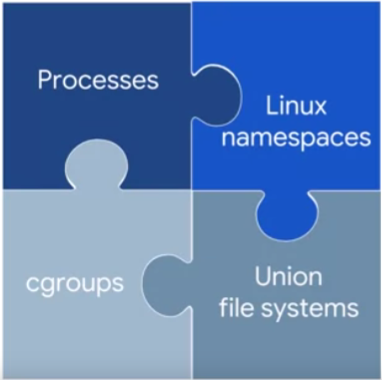
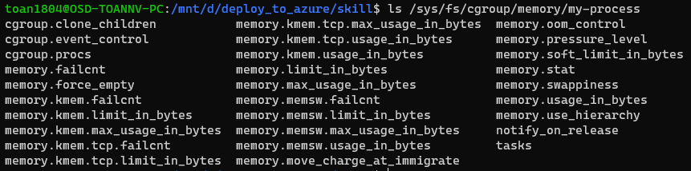
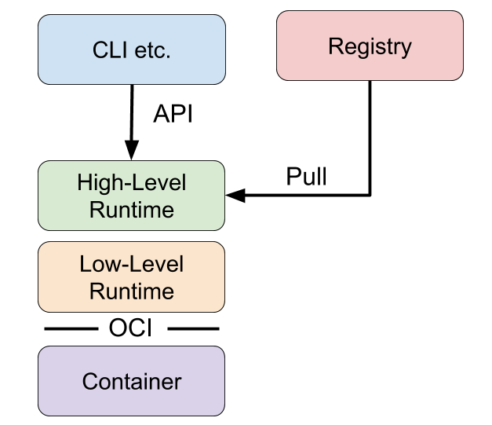
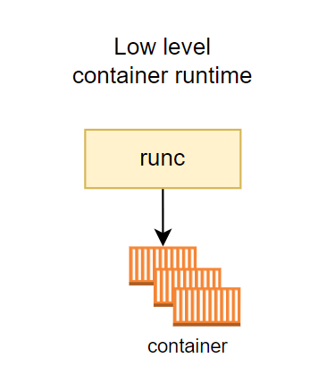
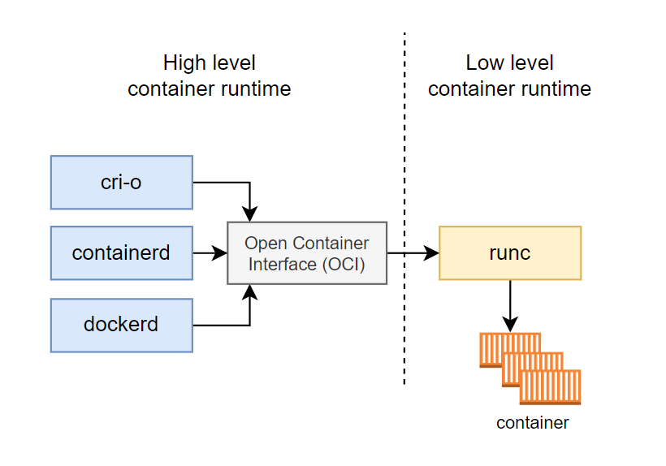
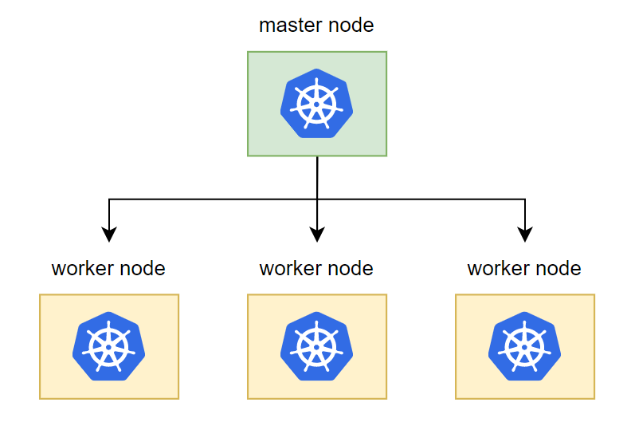
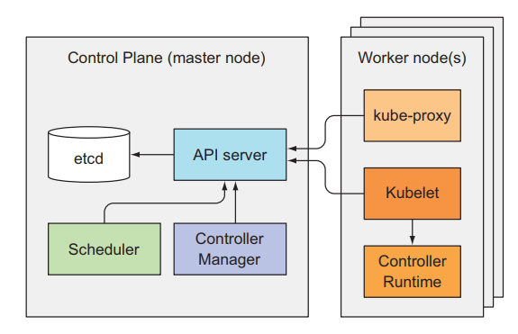
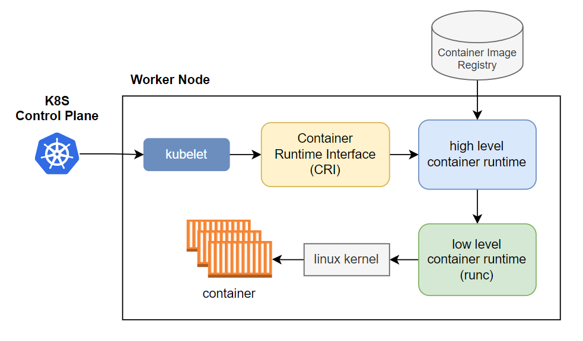

# Container

**Container components:**

Container use a varied set of Linux technologies



Containers are not an intrinsic primitive feature of Linux. Instead, their power to isolate workloads is derived from the composition of several technologies.

- One foundation is the Linux process. Each Linux process has its own virtual memory address space separate from all others. In Linux, processes are rapidly created and destroyed.

- Containers use Linux namespaces to control what an application can see. Process Id numbers, directory trees, IP addresses, and more.

- Containers used Linux cgroups to control what an application can use, its maximum consumption of CPU time, memory, IO bandwidth, and other resources.

- Finally, containers use union file systems to efficiently encapsulate applications and their dependencies into a set of clean minimal layers.
  
  ---

> Container là một công nghệ mà cho phép chúng ta chạy một chương trình trong một môi trường độc lập hoàn toàn với các chương trình còn lại trên cùng một máy tính.

### Linux namespaces

Đây là một tính năng của Linux cho phép ta tạo ra một virtualize system, khá giống với chức năng của các công cụ virtual machine. Đây là tính năng chính giúp process của ta tách biệt hoàn toàn với các process còn lại.

Linux namespaces sẽ bao gồm các thành phần nhỏ hơn như:

- PID namespace cho phép ta tạo các process tách biệt.
- Networking namespace cho phép ta chạy chương trình trên bất kì port nào mà không bị xung độ với các process khác chạy trên server.
- Mount namespace cho phép ta mount và unmount filesystem mà không ảnh hưởng gì tới host filesystem.

Để tạo nó, ta dùng package `unshare`:

```bash
sudo unshare --fork --pid --mount-proc bash
```

Check các tiến trình trong namespaces vừa tạo:

```bash
ps aux
```

### Control groups(cgroups)

> **cgroups** (abbreviated from **control groups**) is a [Linux kernel](https://en.wikipedia.org/wiki/Linux_kernel "Linux kernel") feature that limits, accounts for, and isolates the resource usage (CPU, memory, disk I/O, network, etc.) of a collection of processes.

Khi ta đã có một process riêng biệt với namespace, vậy nếu ta tạo nhiều namespace thì làm thế nào để giới hạn được resource cho từng cái đó, cgroup giải quyết vấn đề đó.

Để tạo cgroups, ta dùng cgcreate.

###### First, install cgroup-tools (for ubuntu and debian):

```bash
sudo apt-get install cgroup-tools
```

###### Then, to create cgroup, we run:

```bash
sudo cgcreate -g memory:my-process
```

It will create a folder in path `/sys/fs/cgroup/memory`, check it:

```bash
ls /sys/fs/cgroup/memory/my-process
```

Ta sẽ thấy khá nhiều file, đây là những file định nghĩa limit của process.



Ví dụ, ta giới hạn memory cho process là 50Mb, ta điều chỉnh tham số trong `memory.kmem.limit_in_bytes` như sau:

```bash
sudo echo 50000000 >  /sys/fs/cgroup/memory/my-process/memory.limit_in_bytes
```

Nếu gặp lỗi `Permission denied`, chạy câu lệnh sau đây trước khi chạy câu lệnh trên:

```bash
sudo chmod 777 /sys/fs/cgroup/memory/my-process/memory.limit_in_bytes
```

Then, to use cgroup, we run:

```bash
sudo cgexec -g memory:my-process bash
```

Lúc này, process được tạo với cgroup có memory limit là 50Mb.

##### Cgroups with namespace

Và ta có thể sử dụng cgroups kết hợp với namespace để tạo một process độc lập và có giới hạn resource nó có thể sử dụng.

```bash
sudo cgexec -g cpu,memory:my-process unshare -uinpUrf --mount-proc sh -c "/bin/hostname my-process && chroot mktemp -d /bin/sh"
```

---

# Container Runtime

> Container runtime là một công cụ đóng vai trò quản lý tất cả quá trình running của một container, bao gồm tạo và xóa container, đóng gói và chia sẻ container.

Container runtime được chia ra làm hai loại:

- Low-level container runtime: với nhiệm vụ chính là tạo và xóa container.
- High level container runtime: quản lý container, tải container image sau đó giải nén container image đó ra và truyền vào trong low level container runtime để nó tạo và chạy container.

**Một vài high level container runtime còn bao gồm cả chức năng đóng gói container thành container image và chuyển nó lên container registry**.



> Container image sẽ lưu tất cả những thứ ta cần để ta chạy một container, ta chỉ cần tải container image và dùng nó để run container, thay vì phải tạo container từ đầu và cài nhiều thứ.

> Container registry là chỗ dùng chứa container image.

### Low-level container runtime



Các công việc chính mà low level container runtime sẽ làm:

- Tạo cgroup.
- Chạy CLI trong cgroup.
- Chạy câu lệnh `Unshare` để tạo namespaces riêng.
- Cấu hình root filesystem.
- Clean up cgroup sau khi câu lệnh hoàn tất.

**Mô phỏng quá trình:**

```bash
  ROOTFS=$(mktemp -d) && UUID=9999
```

- Create cgroup:

```bash
sudo cgcreate -g cpu,memory:$UUID
```

- Configure limit memory for cgroup:

```bash
sudo cgset -r memory.limit_in_bytes=100000000 $UUID
```

- Configure limit cpu for cgroup:

```bash
sudo cgset -r cpu.shares=512 $UUID && sudo cgset -r cpu.cfs_period_us=1000000 $UUID && sudo cgset -r cpu.cfs_quota_us=2000000 $UUID
```

- Create container:

```bash
sudo cgexec -g cpu,memory:$UUID unshare -uinpUrf --mount-proc sh -c "/bin/hostname $UUID && chroot $ROOTFS /bin/sh"
```

- Delete cgroup:

```bash
sudo cgdelete -r -g cpu,memory:$UUID
```

### High level container runtime



> Trong khi low level container runtime tập trung cho việc tạo và xóa container, thì high level container runtime sẽ tập trung cho việc quản lý nhiều container, vận chuyển và quản lý container images, tải và giải nén container image để chuyển xuống cho low level container runtime.

Một thằng high level container runtime phổ biến chắc có lẽ là `containerd`, `containerd` cung cấp cho ta những tính năng sau:

- Tải container image từ container registry.
- Quản lý container image.
- Chạy container từ container image đó.
- Quản lý nhiều container.

---

### Kubernetes work with container runtime

##### K8s architecture



Một kubernetes cluster sẽ bao gồm một master node và một hoặc nhiều worker node.

Với master node có nhiệm vụ chính là quản lý cluster, phân phối và quản lý container tới từng worker node. Worker node có nhiệm vụ chính là nơi chứa các container để chạy ứng dụng.



Kubernetes master sẽ bao gồm 4 component:

- etcd: dùng để lưu trữ trạng thái của cluster.
- API server: thành phần chính mà client hoặc các thành khác sử dụng để giao tiếp với kubernetes cluster.
- Controller Manager: quản lý và tạo các resource tương ứng trong cluster.
- Scheduler: phân phối chọn worker node để chạy container.

Kubernetes worker node sẽ bao gồm 3 thành phần:

- kubelet: quản lý container trên từng worker node.
- kube-proxy
- container runtime

##### K8s work with container runtime



K8s giao tiếp với container runtime thông qua `kubelet`.  `Kubelet` sẽ tương tác với container runtime ở trên worker node thông qua một layer tên là Container Runtime Interface (CRI).

1. Đầu tiên kubernetes master node sẽ báo cho kubelet tạo container.
2. Tiếp theo kubelet sẽ giao tiếp với high level container runtime (cri-o, containerd, ...) thông qua CRI và kêu nó tạo container đi.
3. Lúc này high level container runtime sẽ pull image từ container image registry xuống, extract nó ra và lưu xuống disk.
4. Sau đó low level container runtime sẽ được thông báo và nó sẽ nhảy vào disk để lấy container image để tạo container.
5. Sau khi lấy được container image thì low level container runtime sẽ thực hiện một loạt lệnh xuống dưới linux kernel để tạo container.
