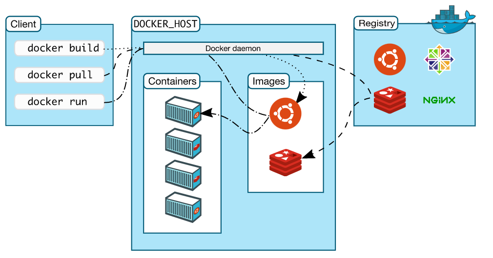
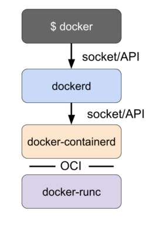
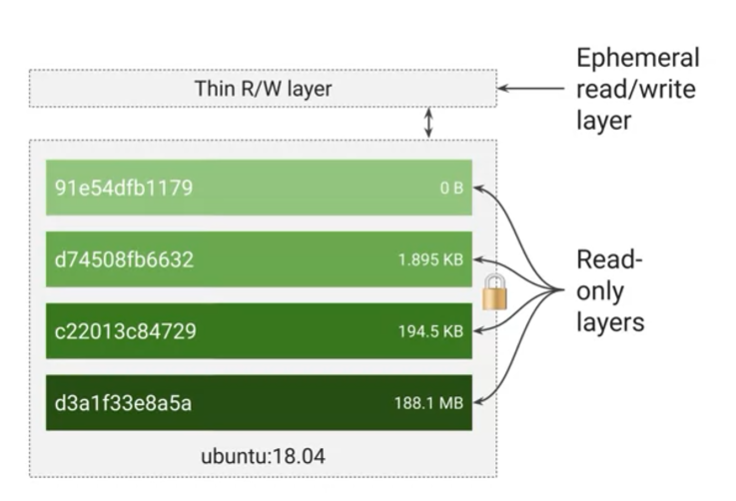
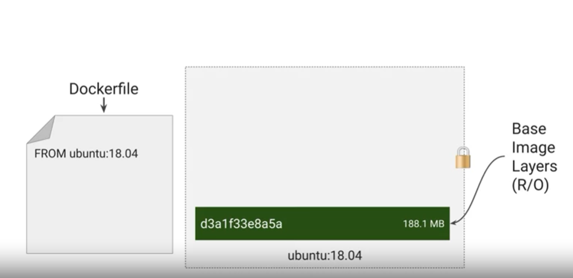
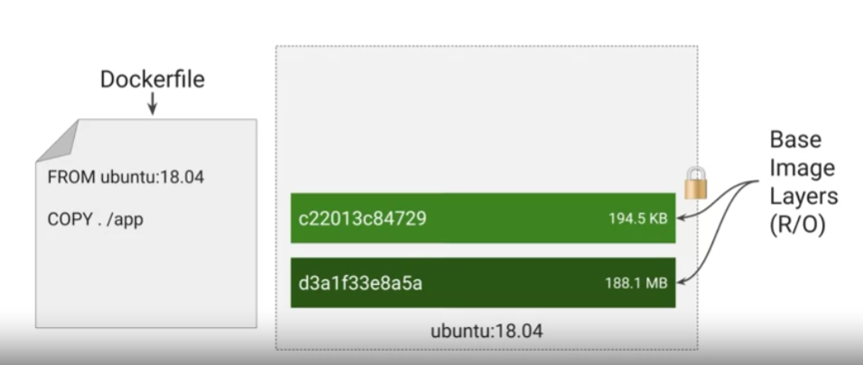
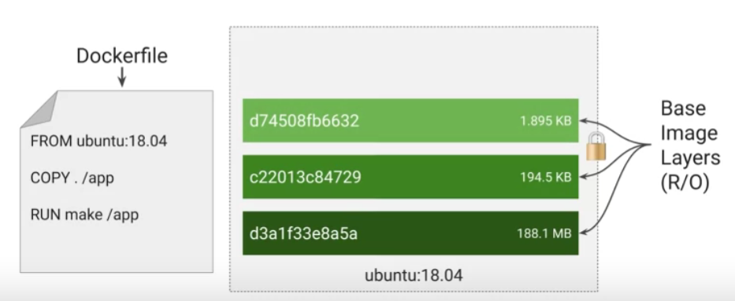
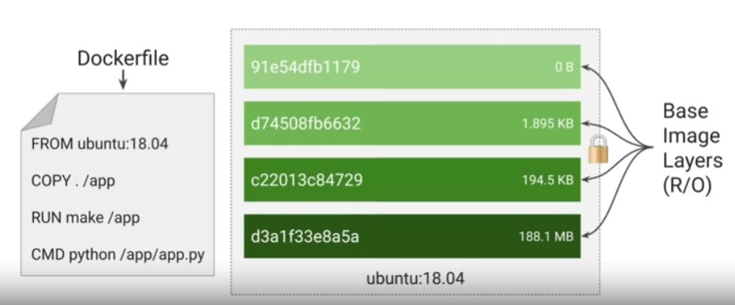
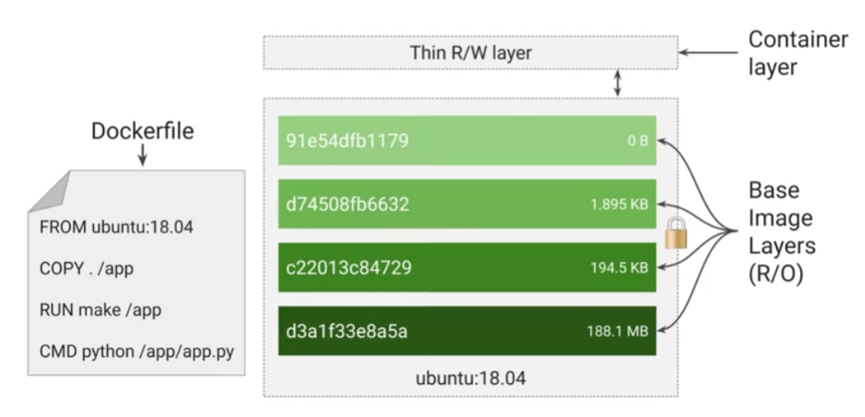
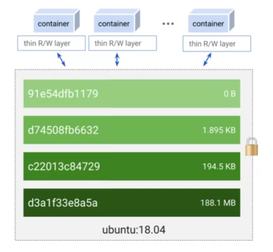
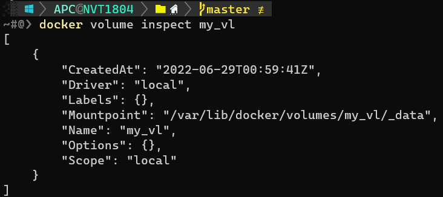

### Docker

##### Docker Architecture



**The Docker daemon**

The Docker daemon (`dockerd`) listens for Docker API requests and manages Docker objects such as images, containers, networks, and volumes. A daemon can also communicate with other daemons to manage Docker services.

**The Docker client**

The Docker client (`docker`) is the primary way that many Docker users interact with Docker. When you use commands such as `docker run`, the client sends these commands to `dockerd`, which carries them out. The `docker` command uses the Docker API. The Docker client can communicate with more than one daemon.

**Docker Desktop**

Docker Desktop is an easy-to-install application for your Mac or Windows environment that enables you to build and share containerized applications and microservices. Docker Desktop includes the Docker daemon (`dockerd`), the Docker client (`docker`), Docker Compose, Docker Content Trust, Kubernetes, and Credential Helper.

**Docker registry**

A Docker *registry* stores Docker images. Docker Hub is a public registry that anyone can use, and Docker is configured to look for images on Docker Hub by default. You can even run your own private registry.

When you use the `docker pull` or `docker run` commands, the required images are pulled from your configured registry. When you use the `docker push` command, your image is pushed to your configured registry.

**Docker objects**

When you use Docker, you are creating and using images, containers, networks, volumes, plugins, and other objects. This section is a brief overview of some of those objects.

**Architecture with engine:**



##### Check Docker info

```bash
docker info
```

**Version:**

```bash
docker version
```

##### Docker system

**Check info:**

```bash
docker system info
```

**Show docker disk usage:**

```bash
docker system df
```

*or* more details: `docker system df -v`

**Remove unused data:**

*Description:* Remove all unused containers, networks, images (both dangling and unreferenced), and optionally, volumes.

```bash
docker system prune [OPTIONS]
```

##### Docker Builder

**Build an image from a Dockerfile:**

```bash
docker builder build [OPTIONS] PATH | URL | -
```

**Remove build cache:**

```bash
docker builder prune
```

##### Folder data

* **In Linux:** `/var/lib/docker`

* **In Windows**: `\wsl$\docker-desktop-data\mnt\wsl\docker-desktop-data\data\docker` or `%localappdata%\Docker\wsl`

##### Dockerfile

> A `Dockerfile` is a text document that contains all the commands a user could call on the command line to assemble an image.

##### Docker image



> A `Docker container image` is a lightweight, standalone, executable package of software that includes everything needed to run an application: code, runtime, system tools, system libraries and settings.

- A container image is structured in layers. The tool you use to build the image reads instructions from a file called the container manifest. In the case of a Docker formatted container image, that's called a Dockerfile.

- Each instruction in the Dockerfile specifies a layer inside the container image. Each layer is read only. When a container runs from this image, it will also have a writable ephemeral topmost layer.

*Example with four commands, each of which creates a layer:*

*Layer 1: Base Image*



*Layer 2: COPY command*



*Layer 3: RUN command*



*Layer 4: CMD command*



*Container from Image:*

- When you launch a new container from an image, the container runtime adds a new writable layer on the top of the underlying layers. This layer is often called the container layer. 

- All changes made to the running container, such as writing new files, modifying existing files, and deleting files, are written to this thin writable container layer. In the ephemeral, when the container is deleted, the contents of this writable layer are lost forever. The underlying container image itself remains unchanged.



Containers promote smaller shared images:

- Because each container has its own writable container layer and all changes are stored in this layer, multiple containers can share access to the same underlying image and yet have their own data state.

- For example, your base application image, may be 200 megabytes, but the difference to the next point release might only be 200 kilobytes. When you build a container, instead of copying the whole image, it creates a layer with just the differences. When you run a container, the container runtime pulls down the layers it needs. When you update, you only need to copy the difference. 
  
  This is much faster than running a new virtual machine.



**You can pull an image from Docker hub:**

```bash
docker pull <image_name>
```

*e.g.* `docker pull debian`. This command will pull an image from Docker hub that named `debian`.

**Or, you can create a custom image with `dockerfile`:**

```bash
docker build <path/to/dockerfile> -t <image_name>:<version>
```

*e.g.* `docker build . -t node:latest`

**Also, you can search image from Docker hub:****

```bash
docker search <image_name>
```

**Manage Docker image in your machine:**

```bash
docker images
```

or

```bash
docker image ls
```

**Remove an image in your machine:**

```bash
docker image rm <image_name|image_id>
```

*e.g.* `docker image rm test`

**Display detailed information on one or more images:**

```bash
docker image inspect [OPTIONS] IMAGE [IMAGE...]
```

##### Container

> A `container` is a standard unit of software that packages up code and all its dependencies so the application runs quickly and reliably from one computing environment to another.

**Run `container` from docker image:**

```bash
docker run [OPTIONS] IMAGE [COMMAND] [ARG...]
```

*e.g.* `docker run -d -p 8000:8000 --name debian-test <image_name|image_id>`

*explaine:* `-d`: for deamon, `-p` for expose port

**Print  docker container is running:**

```bash
docker ps
```

or

```bash
docker container ls
```

**Print all docker container:**

```bash
docker ps -a
```

or

```bash
docker container ls -a
```

**Stop a container:**

```bash
docker stop [OPTIONS] CONTAINER [CONTAINER...]
```

*e.g.* `docker stop debian`

**Start a container:**

```bash
docker start [OPTIONS] CONTAINER [CONTAINER...]
```

*e.g.* `docker start debian`

**Enter the bash/cli in container:**

```bash
docker exec -it <container_name|container_id> bash
```

or with `root`: `docker exec -it -u root <container_name|container_id> bash`

**Remove a docker container:**

```bash
docker container rm <container_name|container_id>
```

or

```bash
docker rm <container_name|container_id>
```

##### Docker Volumes

> Volumes are the preferred mechanism for persisting data generated by and used by Docker containers.

**Create a `volumes`:**

```bash
docker volume create [OPTIONS] [VOLUME]
```

*e.g.* `docker volume create my_vl`

**Print your volumes:**

```bash
docker volume ls
```

**Inspect Volume:**

```bash
docker volume inspect [volume_name]
```

*e.g.* `docker volume inspect my_vl`



**Remove volumes:**

```bash
docker volume rm [volume_name]
```

or remove all unused volumes:

```bash
docker volume prune
```

**Create a container with volumes:**

There are two ways to mount a volume with container:

1. Use flag `--volume` or `-v` for short:
   
   ```bash
   docker run --name [container_name] --volume "[volume_name]":[/path/in/container] [docker_image]
   ```

*e.g.* `docker run -d -it --name node_c --volume "my_vl":/tmp node`

2. Use flag `--mount`:
   
   ```bash
   docker run --mount source=[volume_name],destination=[path_in_container] [docker_image]
   ```

*e.g.* `docker run -d -it --name node_c --mount source=my_vl,target=/tmp node`

**Use *ReadOnlyVolumes***:

By default, all `container` have read and write permission with `volume`, but if you only allow read permission, you can:

```bash
docker run --name [container_name] --volume "[volume_name]":[/path/in/container]:ro [docker_image]
```

*e.g.* `docker run --name node_c --volume "my_vl":/tmp:ro node`

or

```bash
docker run --mount source=[volume_name],destination=[path_in_container],ro [docker_image]
```

*e.g.* `docker run -d -it --name node_c --mount source=my_vl,target=/tmp,ro node`

**Volume with `Docker Compose`:**

You can mount volume with container inside `docker-compose.yaml`:

```yaml
version: "3.9"
services:
  frontend:
    image: node:lts
    volumes:
      - myapp:/home/node/app
volumes:
  myapp:
```

When you run `docker-compose up`, the volume will be created.

A volume may be created directly outside of compose with `docker volume create` and then referenced inside `docker-compose.yml` as follows: 

```yaml
version: "3.9"
services:
  frontend:
    image: node:lts
    volumes:
      - myapp:/home/node/app
volumes:
  myapp:
    external: true
```

##### Docker Networking

> `Docker networking` is primarily used to establish communication between Docker containers and the outside world via the host machine where the Docker daemon is running.

**Network Drivers:**

Docker’s networking subsystem is pluggable, using drivers. Several drivers exist by default, and provide core networking functionality:

- `bridge`: The default network driver. If you don’t specify a driver, this is the type of network you are creating. **Bridge networks are usually used when your applications run in standalone containers that need to communicate.

- `host`: For standalone containers, remove network isolation between the container and the Docker host, and use the host’s networking directly.

- `overlay`: Overlay networks connect multiple Docker daemons together and enable swarm services to communicate with each other. You can also use overlay networks to facilitate communication between a swarm service and a standalone container, or between two standalone containers on different Docker daemons. This strategy removes the need to do OS-level routing between these containers.

- `ipvlan`: IPvlan networks give users total control over both IPv4 and IPv6 addressing. The VLAN driver builds on top of that in giving operators complete control of layer 2 VLAN tagging and even IPvlan L3 routing for users interested in underlay network integration.

- `macvlan`: Macvlan networks allow you to assign a MAC address to a container, making it appear as a physical device on your network. The Docker daemon routes traffic to containers by their MAC addresses. Using the `macvlan` driver is sometimes the best choice when dealing with legacy applications that expect to be directly connected to the physical network, rather than routed through the Docker host’s network stack.

- `none`: For this container, disable all networking. Usually used in conjunction with a custom network driver. `none` is not available for swarm services.

**Create network:**

```bash
docker network create [OPTIONS] NETWORK
```

*e.g.* `docker network create -d bridge my-bridge-network`

`-d` for driver.

**Inspect network:**

```bash
docker network inspect NETWORK
```

*e.g.* `docker network inspect my-bridge-network`

**List networks:**

```bash
docker network ls
```

**Connect a running container to a network:**

```bash
docker network connect [OPTIONS] NETWORK CONTAINER
```

*e.g.* `docker network connect my-bridge-network node_c`

**Connect a container to a network when it starts:**

```bash
docker run -itd --network=NETWORK [IMAGE_NAME|IMAGE_ID]
```

*e.g.*  `docker run -itd --network=my_bridge_network node`

**Remove network:**

```bash
docker network rm NETWORK
```

or remove all unused networks:

```bash
docker network prune
```

**Networks in Docker compose:**

```yaml
...
services:
  app:
    networks:
      - api-net
...
networks:
  api-net:
    driver: host
```

##### Docker utils

**Get logs from a container:**

```bash
docker logs [OPTIONS] CONTAINER
```

**Get statistics of container:**

```bash
docker stats [OPTIONS] [CONTAINER...]
```
