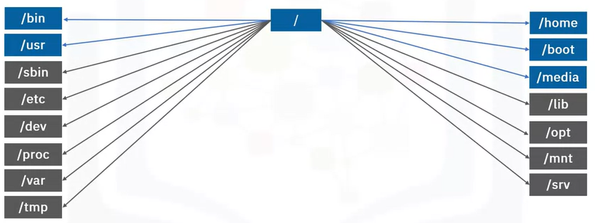

# Linux

### Linux architecture overview

##### Overview

- User:
  
  - The person using the Linux machine
  
  - Completes tasks sush as:
    
    - Using a Web browser to send an email
    
    - Using a music player to listen to a favorite song

- Applications:
  
  Any software that lets you perform a task:
  
  - System tools
  
  - Programming languages
  
  - Shells
  
  - User apps (browsers, text editors, games, and many more)

- Operating system:
  
  - Controls the jobs and programs vital to health and stability
  
  - Also:
    
    - Assigns software to users
    
    - Helps detect errors and prevent failures
    
    - Performs file management tasks

- Kernel:
  
  - Lowest-level software in system
  
  - Starts on boot and remains in memory
  
  - Bridge between apps and hardware
  
  - Key jobs:
    
    - Memory management
    
    - Process management
    
    - Device drivers
    
    - System calls and security

- Hardware
  
  Consists of all physical electronic devices on your PC such as CPU, RAM, Disk, GPU, ...

##### Linux filesystem

- Collection of files in your machine

- Begins at root directory (/)

- Tree-like structure

- Assigns appropriate access rights
  
  
  
  - The very top of the Linux filesystem is the root directory, which contains many other directories and files.
  
  - `/bin`: contains user binary files. Binary files contain the code your machine reads to run programs and execute commands.
  
  - `/usr`: *Secondary hierarchy* for read-only user data; contains the majority of multi-user utilities and applications. Should be shareable and read-only.
  
  - `/home`: Users' [home directories](https://en.wikipedia.org/wiki/Home_directory "Home directory"), containing saved files, personal settings, etc.
  
  - `/boot`: [Boot loader](https://en.wikipedia.org/wiki/Boot_loader "Boot loader") files (e.g., [kernels](https://en.wikipedia.org/wiki/Kernel_(operating_system) "Kernel (operating system)"), [initrd](https://en.wikipedia.org/wiki/Initrd "Initrd")).
  
  - `/media`: Mount points for [removable media](https://en.wikipedia.org/wiki/Removable_media "Removable media").
  
  - `/dev`: [Device files](https://en.wikipedia.org/wiki/Device_file "Device file") (e.g., `/dev/null`, `/dev/disk0`, `/dev/sda1`, `/dev/tty`, `/dev/random`).
  
  - `/mnt`: Temporarily [mounted](https://en.wikipedia.org/wiki/Mount_(computing) "Mount (computing)") filesystems.
